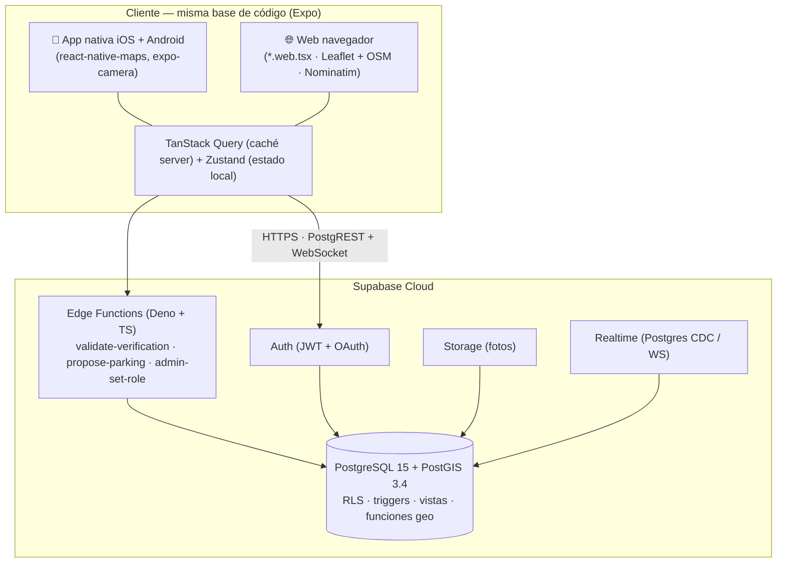
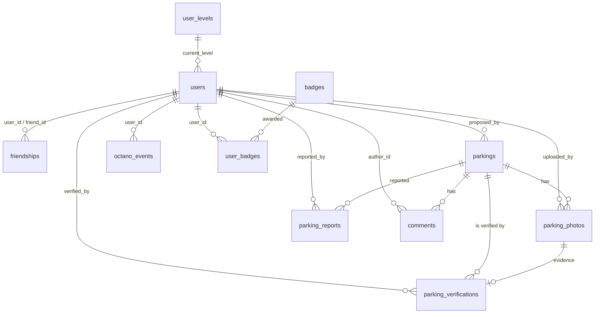
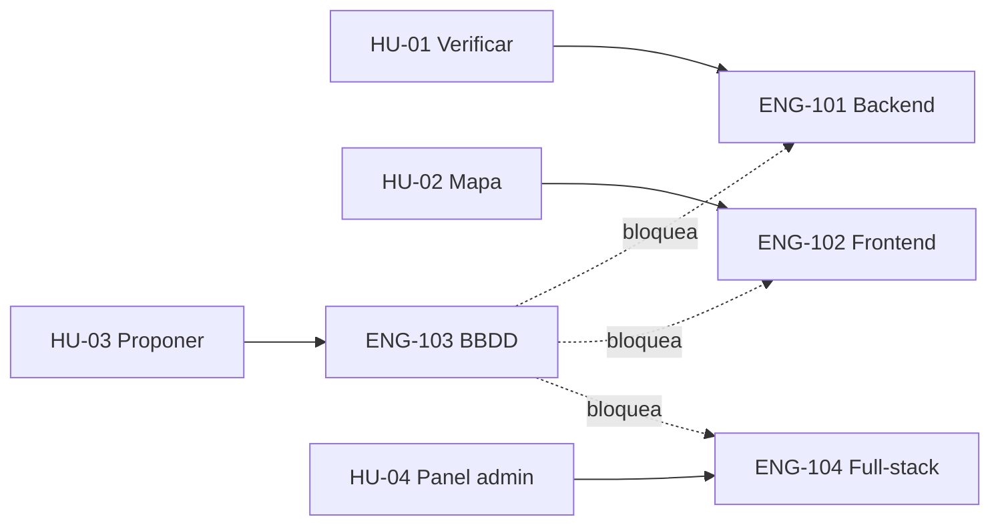

# MotoCiudad

> **Proyecto final del Máster AI4Devs** · Autor: **Curro Martínez Hidalgo (CMH)**
> App móvil (iOS · Android) y web colaborativa para encontrar, proponer y verificar
> parkings de moto, sostenida por una comunidad gamificada (Octanos, niveles, insignias).

**Plataformas:** iOS · Android · Web (navegador) · Panel de administración (web) — [ver detalle](#05-plataformas)

---

## Capturas de pantalla

| Mapa | Aportar | Verificar |
|---|---|---|
|  |  |  |

---

## Índice

Este README es **autosuficiente** para la evaluación y a la vez actúa como **índice** de la
documentación canónica en [`docs/`](docs/) (donde vive el detalle exhaustivo).

- [0. Ficha del proyecto](#0-ficha-del-proyecto)
- [1. Descripción general del producto](#1-descripción-general-del-producto)
- [2. Arquitectura del sistema](#2-arquitectura-del-sistema)
- [3. Modelo de datos](#3-modelo-de-datos)
- [4. Especificación de la API](#4-especificación-de-la-api)
- [5. Historias de usuario](#5-historias-de-usuario)
- [6. Tickets de trabajo](#6-tickets-de-trabajo)
- [7. Pull Requests](#7-pull-requests)
- [8. Uso de IA en el desarrollo](#8-uso-de-ia-en-el-desarrollo)
- [Índice de documentación](#índice-de-documentación)

---

## 0. Ficha del proyecto

### 0.1 Autor
**Curro Martínez Hidalgo (CMH)** — 📧 curromartinez@tallerempresarial.es

### 0.2 Nombre del proyecto
**MotoCiudad** — el "Waze de los parkings de moto".

### 0.3 Descripción breve
MotoCiudad resuelve un problema real: Google Maps no documenta la mayoría de zonas de
aparcamiento de moto, y ese conocimiento vive disperso en grupos de WhatsApp y foros. Los
usuarios pueden **encontrar, proponer y verificar parkings de moto** en su ciudad o cuando
viajan. El dato lo aporta y verifica la propia comunidad, premiada con **Octanos** (puntos),
niveles e insignias, y protegida con mecanismos anti-abuso (geofencing, fotos con timestamp,
moderación por nivel), sin scraping ni bases de datos comerciales.

### 0.4 URLs

| Recurso | URL |
|---|---|
| Repositorio de código | https://github.com/curringas/motociudad |
| Demo web pública (consulta) | https://motociudad.com |
| App móvil (iOS/Android) | Build EAS / TestFlight bajo petición (requiere registrar dispositivo) |
| Contacto para credenciales de evaluación | curromartinez@tallerempresarial.es |

> La app móvil usa cámara, GPS y mapas nativos, por lo que **no funciona con Expo Go**; se
> distribuye por build EAS / TestFlight. La **versión web de consulta** es el entorno "en vivo"
> accesible desde navegador.

### 0.5 Plataformas

MotoCiudad es una única base de código (React Native + Expo) que se sirve en **cuatro frentes**:

| Plataforma | Estado | Consultar (mapa/buscar/detalle) | Aportar / Verificar | Panel admin |
|---|:---:|:---:|:---:|:---:|
| **iOS (iPhone)** | ✅ Nativa (Expo · EAS Build) | ✅ | ✅ | — |
| **Android** | ✅ Nativa (Expo · EAS Build) | ✅ | ✅ | — |
| **Web (navegador)** | ✅ (mismo código, `*.web.tsx`) | ✅ | ⚠️ Solo aviso¹ | ✅ |
| **Panel de administración** | ✅ Solo web | — | — (nunca genera Octanos) | ✅ |

> ¹ Aportar y verificar exigen estar físicamente en el sitio (GPS + foto tomada en el momento),
> algo que un navegador no puede garantizar; en web se remite a la app móvil.

---

## 1. Descripción general del producto

### 1.1 Objetivo y oportunidad

Aparcar la moto en ciudad es un dolor diario para millones de motoristas: Google Maps muestra
parkings de coche, las plazas oficiales de moto están mal señalizadas, y cuando viajas a otra
ciudad no sabes dónde dejar la moto sin riesgo de multa. **No hay competencia directa
consolidada en España** (ElParking, Parkimeter están enfocadas en coche). MotoCiudad ocupa ese
hueco con una app **vertical, comunitaria y gratuita**.

**Flujo E2E prioritario que crea valor completo:** un usuario **propone** un parking → otro
usuario lo **verifica in situ** con foto y GPS → el parking pasa a verificado y ambos ganan
**Octanos** → el resto de la comunidad lo **encuentra** en el mapa.

Detalle completo (personas, KPIs, roadmap, out-of-scope): **[`docs/prd.md`](docs/prd.md)**.

### 1.2 Características y funcionalidades

#### MVP implementado

| Funcionalidad | Estado |
|---|:---:|
| Mapa interactivo con parkings cercanos (PostGIS + radio configurable) | ✅ |
| Filtros en mapa: público / privado / verificado | ✅ |
| Listado de parkings ordenado por distancia | ✅ |
| Detalle de parking con fotos y verificaciones | ✅ |
| Flujo para proponer un parking (3 pasos: ubicación → datos → foto) | ✅ |
| Verificación in situ con GPS y cámara (geofencing ≤ 100 m, foto ≤ 5 min) | ✅ |
| Buscador de direcciones sobre el mapa ("motorista viajero") | ✅ |
| Sistema de Octanos con 7 niveles y reglas anti-abuso | ✅ |
| Login, registro y gestión de sesión (Supabase Auth) | ✅ |
| Edge Functions (`validate-verification`, `propose-parking`) con validación Zod + transacción atómica | ✅ |
| Base de datos con RLS, triggers, vistas y funciones PostGIS | ✅ |
| Versión web de consulta (Leaflet + OSM + Nominatim, responsive) | ✅ |
| Panel de administración web (roles + gestión) — [ver 1.2 Panel admin](#panel-de-administración-web-v13) | ✅ |
| CI/CD (GitHub Actions) + tests unitarios, E2E y de base de datos | ✅ |

#### Panel de administración web (v1.3)

Panel **solo web** con autorización real por RLS + Edge Function (el guard de UI es solo UX):

- Roles (`user` / `contributor` / `admin`) y suspensión global de cuenta.
- Primitivas de autorización SQL (`is_admin()`, `can_manage_parkings()`) usadas por las policies.
- **Usuarios** (solo admin): listar, buscar, filtrar por rol, detalle, cambiar rol, suspender/reactivar.
- **Parkings** (contributor/admin): listar/filtrar, crear (sin Octanos), editar por propiedad, imágenes; verificar y borrar/archivar (solo admin).
- Edge Function `admin-set-role` con anti-escalada de privilegios. **El panel nunca genera Octanos.**

#### Gamificación (resumen)

Los **Octanos** premian las contribuciones y desbloquean **7 niveles** (los niveles solo suben):

| Nivel | Nombre | Octanos | | Acción | Octanos |
|:--:|---|--:|---|---|--:|
| 1 | Pipiolo | 0 | | Proponer un parking | +50 (al verificarse) |
| 2 | Rodador | 101 | | Tu parking queda verificado | +30 (bonus) |
| 3 | Buscaplazas | 501 | | Verificar un parking in situ | +25 |
| 4 | Cartógrafo | 1.501 | | Ser el primer verificador | +15 (bonus) |
| 5 | Centinela | 4.001 | | Reportar parking erróneo (confirmado) | +20 |
| 6 | Maestro Motero | 10.001 | | | |
| 7 | Leyenda del Asfalto | 25.001 | | | |

Baremo completo, insignias y reglas anti-abuso: **[`docs/gamificacion.md`](docs/gamificacion.md)**.

#### Pendiente (roadmap v1.1)

Ranking global/mensual (pantalla "Coming soon"), perfil completo (stats/badges/historial),
insignias desbloqueables (lógica de BD lista, falta UI) y email transaccional con marca propia.

### 1.3 Diseño y experiencia de usuario

Tema oscuro único (sin light theme en MVP), navegación por tabs en móvil y rail lateral +
panel de detalle en escritorio (web responsive). Mockups y sitemap en
**[`docs/componentes-principales.md`](docs/componentes-principales.md)** y `docs/design/`.

### 1.4 Instrucciones de instalación

Ver **[Cómo levantar el proyecto](#cómo-levantar-el-proyecto)** (§ al final) — incluye local con
Docker, contra Cloud, y arranque en **iOS**, **Android** y **web**.

---

## 2. Arquitectura del sistema

### 2.1 Diagrama de arquitectura



### 2.2 Descripción de componentes

- **App (iOS/Android/Web)**: React Native + Expo Router v4 (rutas por ficheros). Features en
  vertical slices bajo `features/<dominio>/` (`api.ts`, `hooks.ts`, `schemas.ts`, `components/`).
- **Supabase Cloud**: PostgreSQL + PostGIS (geo), Auth, Storage, Realtime y Edge Functions.
  La **autorización se aplica exclusivamente vía Row Level Security** — sin API gateway.
- **Edge Functions (Deno)**: toda la lógica de negocio con efectos (otorgar Octanos, geofencing,
  cambio de rol) vive aquí; **nunca en el cliente**.

**Flujo de datos clave — verificar un parking:**

```
Cliente → [subida de foto a Storage] → POST /functions/v1/validate-verification
        → Edge Function valida JWT + geofence + timestamp + anti-abuso
        → RPC PostgreSQL (transacción atómica):
            parking_verification + octano_event + actualizar parking.status
        → { success, octanos_earned, is_first_verifier }
```

Decisiones técnicas, patrones y descarte de alternativas (¿por qué no Firebase / NestJS?):
**[`docs/arquitectura.md`](docs/arquitectura.md)**.

### 2.3 Stack técnico

| Capa | Tecnología | Por qué |
|---|---|---|
| App | **React Native + Expo SDK 52** · TypeScript strict | Un solo código para iOS, Android y web; EAS Build/Update sin Mac ni tiendas para iterar |
| Routing | **Expo Router v4** (file-based) | Estructura predecible, deep links automáticos |
| Estado | **Zustand 4** (local) + **TanStack Query v5** (server) | Caché/refetch sin boilerplate |
| Estilos | **NativeWind 4** (Tailwind para RN) | Tema dark centralizado |
| Mapas | **react-native-maps** (móvil) · **Leaflet + OSM** (web) | Nativo en móvil; sin API key en web |
| Backend | **Supabase Cloud** | PostgreSQL + PostGIS; RLS en lugar de middleware; Auth + Storage + Edge Functions gestionados |
| BD | **PostgreSQL 15 + PostGIS 3.4** | `ST_DWithin`/`ST_Distance` para geofencing y radio |
| Serverless | **Deno + TypeScript** (Edge Functions) | Lógica anti-abuso cerca de los datos |
| Validación | **Zod** | Tipos derivados de schemas, validación en cliente y edge |
| Tests | **Vitest + Maestro + pgTAP + Deno + Playwright** | Pirámide completa |
| CI/CD | **GitHub Actions + EAS Build/Update** | Tests + typecheck por PR; OTA |

### 2.4 Estructura del proyecto y despliegue

Monorepo pnpm (`apps/mobile/` + `supabase/` + `docs/`). Anatomía completa:
**[`docs/estructura-proyecto.md`](docs/estructura-proyecto.md)**. Entornos, hosting, gestión de
secretos y costes: **[`docs/infraestructura.md`](docs/infraestructura.md)**. Ver también
[Estructura del repositorio](#estructura-del-repositorio).

### 2.5 Seguridad y anti-abuso

La Edge Function `validate-verification` aplica, antes de registrar ningún punto:

1. **JWT válido** — usuario autenticado.
2. **Geofence** — usuario a ≤ 100 m del parking (`ST_Distance`).
3. **Foto reciente** — timestamp ≤ 5 min antes del envío.
4. **Sin auto-verificación** — el proponente no verifica su propio parking.
5. **Sin duplicados** — un usuario no verifica el mismo parking dos veces.
6. **Cap diario** — máximo 200 Octanos/día por usuario.

La transacción final (foto + verificación + octano_event + estado del parking) se ejecuta como
**RPC atómica**. El EXIF de geolocalización se elimina en cliente (privacidad). El panel admin
usa **autorización real en servidor** (RLS + Edge Function + triggers anti-escalada), no solo UI.

### 2.6 Estrategia de testing

Pirámide: unitarios rápidos (Vitest), integración, E2E en dispositivo (Maestro) y navegador
(Playwright), y SQL/RLS (pgTAP). **Estado actual: suite verde** — app **55/55** + web **5/5**
(Vitest), **51 asserts pgTAP**, **8 tests Deno** (`admin-set-role`), **16 tests Vitest** de
permisos; `pnpm typecheck` limpio. CI bloquea el merge si falla typecheck/lint/test.

```bash
pnpm test            # unitarios (Vitest)
pnpm typecheck       # tsc --noEmit
supabase test db     # pgTAP (RLS + funciones SQL)
maestro test .maestro/   # E2E móvil
deno test supabase/functions/**/*.test.ts
```

Estrategia completa y cobertura por área crítica: **[`docs/testing.md`](docs/testing.md)**.

---

## 3. Modelo de datos

### 3.1 Diagrama entidad-relación



### 3.2 Entidades principales

| Entidad | Propósito |
|---|---|
| `users` | Perfil público, nivel actual y Octanos acumulados (centro relacional) |
| `user_levels` | Catálogo de los 7 niveles y sus umbrales (seed) |
| `parkings` | Entidad de dominio: datos + `geography(Point,4326)` (PostGIS) |
| `parking_photos` | Fotos con `storage_path` en Supabase Storage |
| `parking_verifications` | Registro de cada verificación in situ |
| `parking_reports` | Reportes de parkings erróneos |
| `octano_events` | Log **inmutable** de todos los puntos ganados (insert-only vía Edge Function) |
| `badges` / `user_badges` | Catálogo de insignias y las desbloqueadas por usuario |

**Todas las tablas tienen RLS activada.** Garantías clave: lectura pública de parkings
verificados; el autor ve sus propuestas pendientes; `octano_events` es insert-only desde Edge
Functions; nadie modifica verificaciones ajenas. Las consultas geo usan
`nearby_parkings(lat, lng, radius_m)` (envuelve `ST_DWithin` con índice GiST).

- **Schema SQL ejecutable, RLS, triggers y funciones** (fuente de verdad): **[`docs/modelo-datos.md`](docs/modelo-datos.md)**
- **Descripción didáctica tabla por tabla** (atributos, tipos, claves): **[`docs/entidades-principales.md`](docs/entidades-principales.md)**

---

## 4. Especificación de la API

MotoCiudad **no expone una API REST custom**: toda la comunicación pasa por Supabase, con tres
patrones de acceso.

| Patrón | Uso | Ejemplo |
|---|---|---|
| **REST auto-generado** (PostgREST) | Lecturas y escrituras con RLS | `POST /rest/v1/parkings` |
| **RPC** (funciones SQL) | Queries complejas (geo, agregaciones) | `POST /rest/v1/rpc/nearby_parkings` |
| **Edge Functions** (Deno) | Lógica crítica con validación server-side | `POST /functions/v1/validate-verification` |

Endpoints documentados (OpenAPI 3.1):

| # | Método | Endpoint | Tipo | Descripción |
|:--:|---|---|---|---|
| 1 | POST | `/rest/v1/rpc/nearby_parkings` | RPC | Búsqueda geoespacial de parkings cercanos |
| 2 | POST | `/rest/v1/parkings` | REST + RLS | Proponer un parking nuevo |
| 3 | POST | `/functions/v1/validate-verification` | Edge Function | Verificar un parking in situ |
| 4 | POST | `/functions/v1/admin-set-role` | Edge Function | Cambio de rol/suspensión (panel admin, privilegiada) |

- **Autenticación:** JWT Bearer (Supabase Auth) + header `apikey`.
- **Formato:** JSON, timestamps ISO 8601, coordenadas `(lng, lat)` WGS84, errores con formato uniforme.

Especificación OpenAPI completa con payloads, esquemas y ejemplos:
**[`docs/especificacion-api.md`](docs/especificacion-api.md)**.

---

## 5. Historias de usuario

Formato Connextra + criterios de aceptación Gherkin (trazables 1:1 con tests E2E). Se detallan
**4 historias** (3 MUST del flujo E2E + 1 del panel admin). Detalle completo con todos los
escenarios y Definition of Done: **[`docs/historias-y-tickets.md`](docs/historias-y-tickets.md)**.

**HU-01 · Verificar un parking in situ** _(MUST · 8 SP)_
> Como motorista que acaba de aparcar en un parking propuesto por otro usuario, quiero confirmar
> in situ con una foto que existe, para que la comunidad confíe en el dato y ganar Octanos.

Criterios clave: verificación válida dentro de 100 m → +25 Octanos; primer verificador → +15
extra y parking pasa a `verified`; rechazos `GEOFENCE_FAIL`, `STALE_PHOTO`, `ALREADY_VERIFIED`,
`SELF_VERIFICATION_FORBIDDEN`, `DAILY_CAP_REACHED`.

**HU-02 · Encontrar parkings cercanos** _(MUST · 13 SP)_
> Como motorista que llega a una zona desconocida, quiero ver en un mapa los parkings de moto a
> ≤ 2 km con sus características, para elegir el mejor sin dar vueltas.

Criterios clave: mapa centrado en mi ubicación; pins por tipo/estado; recarga por viewport
(< 500 ms p95); bottom sheet con "Llévame" y "Detalles"; fallback sin permiso de ubicación.

**HU-03 · Proponer un parking nuevo** _(MUST · 8 SP)_
> Como motorista que conoce un parking que no aparece, quiero añadirlo con ubicación,
> características y foto, para que otros lo encuentren y ganar Octanos.

Criterios clave: formulario en 3 pasos; parking creado en `pending` + `octano_event` de +50
pendiente; aviso si ya existe uno a < 30 m; al verificarse, los +50 pasan a `confirmed` (+30 bonus).

**HU-04 · Gestionar la comunidad desde el panel de administración** _(v1.3 · 13 SP)_
> Como administrador, quiero un panel web para gestionar usuarios (roles, suspensión) y parkings
> (crear, editar, verificar, borrar), para moderar la cola de aportes y mantener sano el dataset.

Criterios clave: acceso gateado por rol; cambio de rol solo vía `admin-set-role`; contributor
edita solo lo suyo; admin verifica/borra; crear desde el panel no da Octanos.

---

## 6. Tickets de trabajo

Cada historia se materializa en tickets técnicos (backend, frontend, base de datos). Tickets
completos con subtareas, archivos afectados, criterios técnicos y Definition of Done:
**[`docs/historias-y-tickets.md`](docs/historias-y-tickets.md)** §3.

| Ticket | Tipo | Historia | Estimación | Estado |
|---|---|---|---|:---:|
| **ENG-101** · Edge Function `validate-verification` (geofence + anti-abuso + Octanos) | Backend / Serverless | HU-01 | 16 h | ✅ |
| **ENG-102** · Pantalla "Mapa" con pins, clustering y bottom sheet | Frontend / Mobile | HU-02 | 20 h | ✅ |
| **ENG-103** · Migración inicial `parkings` con índice GiST y RLS + `nearby_parkings` | Base de datos | HU-03 (soporta HU-01/02) | 8 h | ✅ |
| **ENG-104** · Panel de administración web (roles + gestión, RLS + Edge Function) | Full-stack | HU-04 | 3 d | ✅ |

**Trazabilidad** (HU → tickets):



---

## 7. Pull Requests

El flujo de integración se ha llevado por ramas verificadas (typecheck + suite de tests verde
antes de cada merge). Los hitos principales se documentan como Pull Requests con título,
descripción (qué cambia, por qué, impacto con _diffstat_) y trazabilidad a la historia/ticket
correspondiente. Bitácora detallada de la entrega final:
**[`entrega-final-CMH.md`](entrega-final-CMH.md)**.

| PR | Alcance | Base ← Head | Historia/Ticket | Estado |
|---|---|---|---|:---:|
| [#1](https://github.com/curringas/motociudad/pull/1) | Entrega 2 — gamificación (Octanos/niveles) y verificación de plazas | `estado1_valido` ← `feature-entrega2-CMH` | HU-03 / gamificación + verificación | ✅ |
| [#2](https://github.com/curringas/motociudad/pull/2) | Panel de administración web — roles, suspensión y gestión de parkings | `base/pre-admin-panel` ← `feature-admin-panel-CMH` | HU-04 / OpenSpec `admin-panel` | ✅ |

---

## 8. Uso de IA en el desarrollo

Este proyecto es fruto del máster **AI4Devs**: usar la IA como copiloto real. El desarrollo se
hizo con **Claude Code** (Anthropic, modelo **Claude Opus 4.8**, contexto 1M) aplicando **Spec
Driven Development** (dos sistemas en paralelo: skills *superpowers* y **OpenSpec**), MCPs
(**Supabase**, **XcodeBuildMCP**, **Playwright**) y git worktrees para trabajo en paralelo.

Registro completo de metodología, herramientas, operaciones y **prompts clave por sección**
(producto, arquitectura, modelo de datos, API, tests…): **[`prompts.md`](prompts.md)**.

Prácticas destacables:
- **Spec antes que código**: `prd.md`, `arquitectura.md`, `modelo-datos.md`… mantenidos en sincronía con el código.
- **Un bug real de RLS** (el admin no podía borrar/archivar) fue detectado al escribir tests pgTAP y corregido — documentado en `entrega-final-CMH.md`.
- **Subagentes especializados** con roles (`prd-keeper`, `migration-builder`, …) definidos en **[`docs/AGENTS.md`](docs/AGENTS.md)**.

---

## Cómo levantar el proyecto

### Requisitos previos
- [Node.js](https://nodejs.org/) v20+ · [pnpm](https://pnpm.io/) (`npm i -g pnpm`)
- [Docker Desktop](https://www.docker.com/products/docker-desktop/) y [Supabase CLI](https://supabase.com/docs/guides/cli) (para backend local)
- Xcode (build iOS) / Android Studio (build Android)

### Variables de entorno
```bash
cp .env.example .env   # rellenar con las claves de Supabase (solicítalas al autor)
```
```env
EXPO_PUBLIC_SUPABASE_URL=https://<proyecto>.supabase.co
EXPO_PUBLIC_SUPABASE_ANON_KEY=<anon key pública>
SUPABASE_SERVICE_ROLE_KEY=<service role — solo scripts locales>
```

### Opción A — Local con Docker (recomendada)
```bash
pnpm install
supabase start          # PostgreSQL + Auth + Storage + Edge Functions locales
supabase db reset       # migraciones + seed.sql
pnpm dev:mobile         # servidor de Expo
```

### Opción B — Contra Supabase Cloud
Con las claves de producción en `.env`: `pnpm install && pnpm dev:mobile`.

### Ejecutar en dispositivo
La app usa cámara/GPS/mapas nativos (**no Expo Go**):

**iOS (iPhone):**
```bash
cd apps/mobile
npx expo prebuild --platform ios
npx expo start --dev-client --localhost
# Abrir apps/mobile/ios/MotoCiudad.xcworkspace en Xcode → seleccionar iPhone → Play
```

**Android:**
```bash
cd apps/mobile
npx expo prebuild --platform android
npx expo run:android          # requiere Android Studio / SDK + emulador o dispositivo
```

**Build EAS (compartir sin compilar):** el autor puede generar un build de TestFlight /
distribución interna; contactar para registrar el dispositivo.

### Versión web (navegador)
```bash
cp apps/mobile/.env.example apps/mobile/.env   # credenciales de Supabase
pnpm install
pnpm --filter mobile web                       # desarrollo → http://localhost:8081
pnpm --filter mobile web:export                # build estático → apps/mobile/dist/
pnpm --filter mobile web:serve                 # sirve dist/ → http://localhost:3000
```
Incluye mapa Leaflet + OSM, buscador Nominatim y botón "Cómo llegar". Aportar/verificar son
exclusivos de la app móvil. Usa ficheros `*.web.tsx` que el bundler de iOS/Android nunca resuelve.

### Ejecutar los tests
```bash
pnpm test            # unitarios (Vitest)
pnpm typecheck
supabase test db     # pgTAP (requiere Supabase local)
maestro test .maestro/   # E2E (requiere simulador iOS)
```

---

## Estado del MVP

**Implementado y funcionando:** mapa con parkings/filtros/pins, listado por distancia, proponer
(3 pasos), detalle con fotos/verificaciones, verificación in situ (geofencing/cámara/anti-abuso/
Octanos), buscador de direcciones, login/registro, Edge Functions con transacciones atómicas,
BD con RLS/PostGIS/triggers, versión web de consulta, panel de administración web, CI/CD.

**Limitaciones conocidas:** al aportar, la foto se sube a Storage pero no refresca en el detalle
(caché); Ranking y Perfil son placeholders ("Coming soon").

**Pendiente antes de producción:** email transaccional propio, activar Sentry, publicar en
stores, dominio propio para Universal Links, y **desplegar la web a una URL pública** (§0.4).

---

## Estructura del repositorio

```
motociudad/
├── apps/mobile/                    # App React Native (Expo) — iOS, Android y web
│   ├── app/                        # Rutas (Expo Router); app/admin/*.web.tsx = panel admin
│   ├── features/                   # Slices por dominio: parkings, verifications, auth,
│   │                               #   gamification, search, admin (api/hooks/schemas/components)
│   ├── components/ · lib/ · stores/ · hooks/ · types/
│   └── **/*.web.tsx                # Overrides de plataforma web
├── supabase/
│   ├── migrations/                 # Migraciones SQL versionadas
│   ├── functions/                  # Edge Functions (validate-verification, propose-parking, admin-set-role)
│   ├── tests/                      # pgTAP (RLS + funciones SQL)
│   └── seed.sql
├── docs/                           # Documentación canónica (ver índice abajo)
├── openspec/                       # Specs OpenSpec (Spec Driven Development)
├── .github/workflows/              # GitHub Actions (CI + EAS)
├── .maestro/                       # Tests E2E móvil
├── prompts.md · entrega-final-CMH.md   # Registro de IA + bitácora entrega final
└── README.md
```

### Índice de documentación

| Documento | Contenido |
|---|---|
| [`docs/prd.md`](docs/prd.md) | Product Requirements: problema, personas, features, roadmap, KPIs |
| [`docs/arquitectura.md`](docs/arquitectura.md) | Stack, decisiones técnicas, patrones, versión web |
| [`docs/modelo-datos.md`](docs/modelo-datos.md) | Schema SQL ejecutable, RLS, triggers, funciones PostGIS, ER |
| [`docs/entidades-principales.md`](docs/entidades-principales.md) | Descripción didáctica tabla por tabla |
| [`docs/especificacion-api.md`](docs/especificacion-api.md) | OpenAPI 3.1 de los endpoints (REST / RPC / Edge Functions) |
| [`docs/componentes-principales.md`](docs/componentes-principales.md) | Mapa de componentes y sitemap de navegación |
| [`docs/estructura-proyecto.md`](docs/estructura-proyecto.md) | Anatomía del monorepo y decisiones de organización |
| [`docs/gamificacion.md`](docs/gamificacion.md) | Octanos, niveles, insignias y reglas anti-abuso |
| [`docs/historias-y-tickets.md`](docs/historias-y-tickets.md) | Historias de usuario (Gherkin) y tickets de trabajo |
| [`docs/testing.md`](docs/testing.md) | Estrategia de tests y cobertura por área |
| [`docs/infraestructura.md`](docs/infraestructura.md) | Entornos, CI/CD, secretos y costes |
| [`docs/AGENTS.md`](docs/AGENTS.md) · [`docs/CLAUDE.md`](docs/CLAUDE.md) | Subagentes y guía de trabajo con IA |
| [`prompts.md`](prompts.md) · [`entrega-final-CMH.md`](entrega-final-CMH.md) | Prompts clave y bitácora de la entrega final |

---

## Autor

**Curro Martínez Hidalgo (CMH)** · Máster AI4Devs · 📧 curromartinez@tallerempresarial.es
