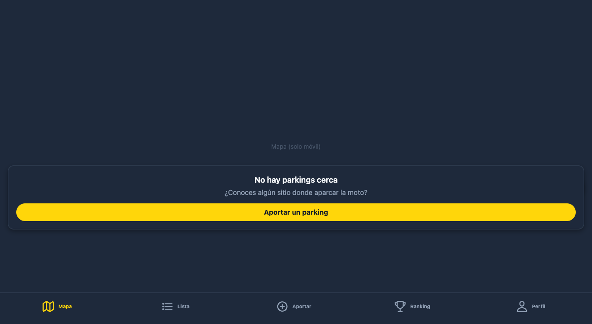
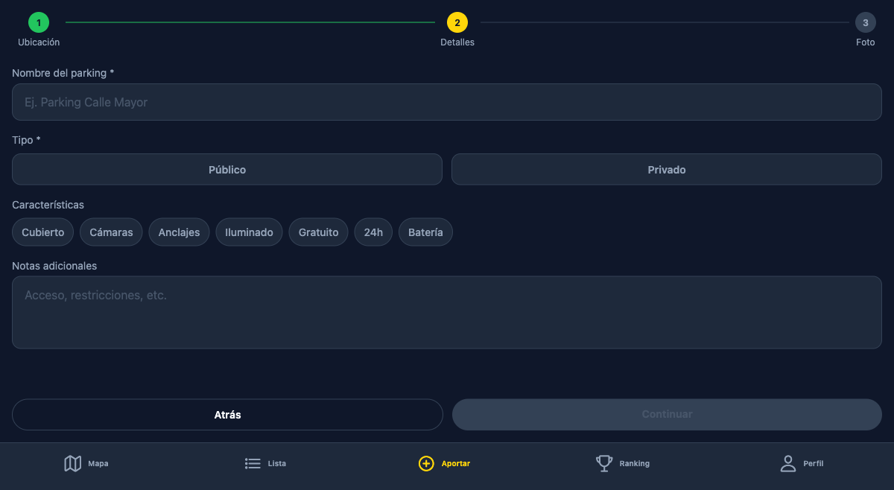

# MotoCiudad

> Proyecto final del Máster AI4Devs · Autor: **Curro Martinez**

**MotoCiudad** es una app móvil colaborativa para motoristas urbanos que resuelve un problema real: Google Maps no documenta la mayoría de zonas de aparcamiento de moto, y ese conocimiento vive disperso en grupos de WhatsApp y foros.

Los usuarios pueden **encontrar, proponer y verificar parkings de moto** en su ciudad o cuando viajan. El sistema se sostiene en una **comunidad gamificada** que premia las contribuciones con **Octanos** (puntos), niveles e insignias — similar al modelo de Waze, pero para aparcamientos de moto.

**Diferencial clave**: el dato lo aporta y verifica la propia comunidad, con mecanismos anti-abuso (geofencing, fotos con timestamp, moderación por nivel), sin scraping ni bases de datos comerciales.

---

## Capturas de pantalla

| Mapa | Aportar | Verificar |
|---|---|---|
|  |  |  |

---

## Índice

1. [Problema y oportunidad](#problema-y-oportunidad)
2. [Funcionalidades implementadas](#funcionalidades-implementadas)
3. [Arquitectura](#arquitectura)
4. [Stack técnico y decisiones](#stack-técnico-y-decisiones)
5. [Modelo de datos](#modelo-de-datos)
6. [Sistema de gamificación](#sistema-de-gamificación)
7. [Seguridad y anti-abuso](#seguridad-y-anti-abuso)
8. [Tests](#tests)
9. [Uso de IA en el desarrollo](#uso-de-ia-en-el-desarrollo)
10. [Cómo levantar el proyecto](#cómo-levantar-el-proyecto)
11. [Estado del MVP](#estado-del-mvp)
12. [Estructura del repositorio](#estructura-del-repositorio)

---

## Problema y oportunidad

Aparcar la moto en ciudad es un dolor diario para millones de motoristas:

- Google Maps muestra parkings de coche, no zonas habilitadas para moto.
- Las plazas oficiales de moto en muchas ciudades están mal señalizadas o no aparecen en ningún mapa público.
- Los parkings privados con tarifa mensual para moto no se anuncian online.
- Cuando viajas a otra ciudad, no sabes dónde dejar la moto sin riesgo de multa.
- El conocimiento existe en la comunidad pero está fragmentado y sin estructura.

No hay competencia directa consolidada en España. Las apps de parking generalistas (ElParking, Parkimeter) están enfocadas en coche y servicios concertados. Existe espacio para una **app vertical, comunitaria y gratuita** que se convierta en el "Waze de los parkings de moto".

---

## Funcionalidades implementadas

### MVP completado

| Funcionalidad | Estado |
|---|---|
| Mapa interactivo con parkings cercanos (PostGIS + radio configurable) | ✅ |
| Filtros en mapa: público / privado / verificado | ✅ |
| Listado de parkings ordenado por distancia | ✅ |
| Pantalla de detalle de parking con fotos y verificaciones | ✅ |
| Flujo completo para proponer un parking (3 pasos: ubicación → datos → foto) | ✅ |
| Verificación in situ con GPS y cámara (geofencing ≤ 100 m, foto ≤ 5 min) | ✅ |
| Sistema de Octanos con 7 niveles y reglas anti-abuso | ✅ |
| Login, registro y gestión de sesión con Supabase Auth | ✅ |
| Edge Function `validate-verification` con validación Zod + transacción atómica | ✅ |
| Edge Function `propose-parking` con registro de Octanos | ✅ |
| Base de datos con RLS, triggers, vistas materializadas y funciones PostGIS | ✅ |
| CI/CD con GitHub Actions (typecheck, tests, build EAS) | ✅ |
| Tests unitarios (Vitest), E2E (Maestro) y de base de datos (pgTAP) | ✅ |

### Pendiente para v1.1

| Funcionalidad | Notas |
|---|---|
| Ranking global y mensual | Pantalla muestra "Coming soon" |
| Perfil completo (stats, badges, historial de Octanos) | Pantalla placeholder |
| Insignias (badges) desbloqueables | Lógica de BD lista; falta UI |
| Email transaccional con marca propia | Actualmente sale con marca Supabase |

> **Versión web**: ya disponible como build local en el navegador (ver [Versión web (navegador)](#versión-web-navegador)). Reutiliza el mismo código de la app móvil mediante ficheros específicos de plataforma; las librerías nativas (mapas, cámara) se sustituyen en web por equivalentes de navegador.

---

## Arquitectura

```
┌─────────────────────────────────────────────────────────────┐
│                    APP MÓVIL (iOS + Android)                │
│                                                             │
│   ┌────────────┐   ┌────────────┐   ┌────────────────┐     │
│   │   Mapa     │   │   Lista    │   │ Aportar/Verif. │     │
│   │ (RN Maps)  │   │ (FlashList)│   │ (Camera + GPS) │     │
│   └────────────┘   └────────────┘   └────────────────┘     │
│                                                             │
│   ┌────────────────────────────────────────────────────┐   │
│   │  TanStack Query (caché) + Zustand (estado local)   │   │
│   └────────────────────────────────────────────────────┘   │
└─────────────────────┬───────────────────────────────────────┘
                      │ HTTPS (PostgREST + WebSocket)
                      ▼
┌─────────────────────────────────────────────────────────────┐
│                       SUPABASE CLOUD                        │
│                                                             │
│   ┌──────────────┐  ┌──────────────┐  ┌──────────────────┐  │
│   │     Auth     │  │   Storage    │  │  Realtime (WS)   │  │
│   │ (JWT + OAuth)│  │  (S3-like)   │  │  (Postgres CDC)  │  │
│   └──────────────┘  └──────────────┘  └──────────────────┘  │
│                                                             │
│   ┌────────────────────────────────────────────────────┐   │
│   │           PostgreSQL 15 + PostGIS 3.4              │   │
│   │   (RLS policies, triggers, vistas materializadas)  │   │
│   └────────────────────────────────────────────────────┘   │
│                                                             │
│   ┌────────────────────────────────────────────────────┐   │
│   │  Edge Functions (Deno / TypeScript)                │   │
│   │  · validate-verification  (geofence + anti-abuso)  │   │
│   │  · propose-parking        (registro de Octanos)    │   │
│   └────────────────────────────────────────────────────┘   │
└─────────────────────────────────────────────────────────────┘
```

### Flujo de datos clave

**Verificar un parking:**

```
Cliente → [subida foto a Storage] → [POST /functions/validate-verification]
         → Edge Function valida JWT + geofence + timestamp + anti-abuso
         → RPC PostgreSQL (transacción atómica):
             insertar parking_verification + octano_event + actualizar parking.status
         → respuesta { success, octanos_earned, is_first_verifier }
```

La lógica de negocio con efectos (Octanos, estado de parking) **nunca se ejecuta en el cliente** — siempre en Edge Functions que validan el JWT del usuario y aplican RLS.

---

## Stack técnico y decisiones

| Capa | Tecnología | Por qué |
|---|---|---|
| App móvil | **React Native + Expo SDK 52** | TypeScript end-to-end, EAS Build elimina necesidad de Mac para iOS, EAS Update permite OTA en horas |
| Routing | **Expo Router v4** (file-based) | Estructura predecible, deep links automáticos |
| Estado global | **Zustand 4** | Minimalista para filtros de UI y sesión |
| Data fetching | **TanStack Query v5** | Caché, refetch y estados de loading/error sin boilerplate |
| Estilos | **NativeWind 4** (Tailwind para RN) | Misma sintaxis que Tailwind CSS, tema dark centralizado |
| Mapas | **react-native-maps** | Apple Maps nativo en iOS, look & feel del sistema, sin coste por MAU |
| Backend | **Supabase Cloud** | PostgreSQL real con PostGIS para queries geoespaciales; RLS en lugar de middleware de autorización; Auth + Storage + Edge Functions sin servidores que mantener |
| Base de datos | **PostgreSQL 15 + PostGIS 3.4** | `ST_DWithin` y `ST_Distance` para geofencing y búsqueda por radio |
| Serverless | **Deno + TypeScript** (Edge Functions) | Lógica anti-abuso cerca de los datos; mismo lenguaje que el cliente |
| Validación | **Zod** | Tipos derivados de schemas (`z.infer<>`), validación runtime en cliente y edge |
| Tests | **Vitest + Maestro + pgTAP** | Pirámide: unitarios rápidos, E2E en dispositivo real, SQL para RLS |
| CI/CD | **GitHub Actions + EAS Build** | Tests + typecheck en cada PR; builds y OTA automáticos |

**¿Por qué no Firebase?** Firestore no es relacional y el modelo de gamificación (Octanos transaccionales, sumas con joins por ciudad, rankings) es mucho más natural en SQL. Además el soporte de PostGIS en PostgreSQL es imprescindible para las consultas geoespaciales.

**¿Por qué no NestJS/Laravel propio?** Más boilerplate, más infra, y no aporta nada que Supabase no cubra — con la ventaja adicional de que PostgreSQL es estándar y la app no queda atada a un proveedor propietario.

---

## Modelo de datos

El schema completo está documentado en [`docs/modelo-datos.md`](docs/modelo-datos.md). Tablas principales:

```
users                  — perfil público, nivel, Octanos acumulados
parkings               — datos del parking + geography (PostGIS)
parking_photos         — fotos con storage_path en Supabase Storage
parking_verifications  — registro de cada verificación in situ
octano_events          — log inmutable de todos los puntos ganados
user_levels            — tabla de niveles y umbrales (seed data)
user_badges            — insignias desbloqueadas por usuario
```

Todas las tablas tienen **Row Level Security activada**. Las políticas garantizan:
- Cualquier usuario puede leer parkings verificados
- Solo el autor puede ver sus propuestas pendientes
- `octano_events` es insert-only desde Edge Functions (el cliente nunca escribe directamente)
- Ningún usuario puede modificar verificaciones ajenas

Las consultas geoespaciales usan la función SQL `nearby_parkings(lat, lng, radius_m)` que envuelve `ST_DWithin` para eficiencia con índice GIST.

---

## Sistema de gamificación

Documentado en detalle en [`docs/gamificacion.md`](docs/gamificacion.md).

### Octanos — acciones puntuables

| Acción | Octanos |
|---|---|
| Proponer un parking nuevo | +50 (se acreditan al verificarse) |
| Tu parking queda verificado | +30 (bonus diferido) |
| Verificar un parking con foto in situ | +25 |
| Ser el primer verificador | +15 (bonus adicional) |
| Reportar parking erróneo (confirmado) | +20 |

### 7 niveles de usuario

| Nivel | Nombre | Octanos requeridos |
|---|---|---|
| 1 | Pipiolo | 0 |
| 2 | Rodador | 101 |
| 3 | Buscaplazas | 501 |
| 4 | Cartógrafo | 1.501 |
| 5 | Centinela | 4.001 |
| 6 | Maestro Motero | 10.001 |
| 7 | Leyenda del Asfalto | 25.001 |

Los niveles **solo suben** — los Octanos son permanentes. Cada nivel desbloquea privilegios (el Rodador puede verificar, el Cartógrafo puede reportar con peso doble, etc.).

---

## Seguridad y anti-abuso

La Edge Function `validate-verification` aplica estas reglas antes de registrar ningún punto:

1. **JWT válido** — usuario autenticado con sesión activa
2. **Geofence** — usuario a ≤ 100 m del parking (PostGIS `ST_Distance`)
3. **Foto reciente** — timestamp de la foto ≤ 5 minutos antes del envío
4. **Sin auto-verificación** — el proponente no puede verificar su propio parking
5. **Sin duplicados** — un usuario no puede verificar el mismo parking dos veces
6. **Cap diario** — máximo 200 Octanos/día por usuario

La transacción final (foto + verificación + octano_event + actualización de estado del parking) se ejecuta como una **RPC atómica en PostgreSQL**, nunca parcialmente.

---

## Tests

Estrategia documentada en [`docs/testing.md`](docs/testing.md).

```bash
# Tests unitarios (Vitest) — lógica pura, hooks, validators
pnpm test
pnpm test --coverage

# Tests E2E (Maestro) — flujos completos en simulador/dispositivo
maestro test .maestro/

# Tests de base de datos (pgTAP) — RLS y funciones SQL
supabase test db

# Tests de Edge Functions (Deno)
deno test supabase/functions/**/*.test.ts
```

**Cobertura objetivo por área crítica:**
- Lógica anti-abuso (geofencing, cap diario, cooldown): **90%**
- RLS policies: **100% de las políticas escritas**
- Reglas de subida de nivel: **100%**

Los tests de CI bloquean el merge si fallan typecheck, lint o cualquier test unitario.

---

## Uso de IA en el desarrollo

Este proyecto es fruto del máster **AI4Devs**, centrado en usar IA como copiloto real de desarrollo. El 100% del código fue desarrollado con **Claude Code** (Anthropic) como asistente principal, aplicando las siguientes técnicas:

### Spec Driven Development

Todo el proyecto sigue una metodología de **Spec Driven Development**: antes de escribir código, se especifica en documentos Markdown (`prd.md`, `arquitectura.md`, `modelo-datos.md`, `gamificacion.md`). Claude Code lee estos documentos al inicio de cada sesión para mantener coherencia con las decisiones previas.

### Subagentes especializados

El proyecto define subagentes con roles específicos documentados en [`docs/AGENTS.md`](docs/AGENTS.md): `prd-keeper` (mantiene los specs actualizados), `migration-builder` (crea migraciones SQL con RLS), `ui-implementer` (traduce mocks a componentes), `gamification-engineer` (lógica de Octanos).

### Flujo de trabajo con IA

1. **Brainstorming** — explorar el problema antes de implementar
2. **Especificación** — documentar la solución en Markdown antes de codificar
3. **Implementación** — Claude Code genera el código siguiendo el spec
4. **Verificación** — validación manual + tests automatizados antes de dar por completado
5. **Documentación sincronizada** — specs y código nunca divergen

### Herramientas de IA utilizadas

- **Claude Code (Anthropic)** — desarrollo completo de la app y backend
- **Claude Sonnet 4.6** — generación de código, debugging, revisión de arquitectura
- **MCP Supabase** — Claude Code accede directamente a la DB para consultas y migraciones
- **MCP Playwright** — automatización de pruebas visuales

El objetivo del máster es demostrar cómo un desarrollador puede construir un producto completo de calidad producción aprovechando la IA como multiplicador de productividad, no como sustituto del criterio técnico.

---

## Cómo levantar el proyecto

### Requisitos previos

- [Node.js](https://nodejs.org/) v20 o superior
- [pnpm](https://pnpm.io/installation) — `npm install -g pnpm`
- [Docker Desktop](https://www.docker.com/products/docker-desktop/) (para Supabase local)
- [Supabase CLI](https://supabase.com/docs/guides/cli) — `brew install supabase/tap/supabase`
- Xcode instalado (solo para build iOS nativo)

### Variables de entorno

```bash
cp .env.example .env
```

Rellena el `.env` con las claves del proyecto Supabase (solicítalas al autor):

```env
EXPO_PUBLIC_SUPABASE_URL=https://<proyecto>.supabase.co
EXPO_PUBLIC_SUPABASE_ANON_KEY=<anon key pública>
SUPABASE_SERVICE_ROLE_KEY=<service role key — solo para scripts locales>
```

> Las claves del proyecto de evaluación están disponibles contactando al autor: **curromartinez@tallerempresarial.es**

### Opción A — Desarrollo local completo (recomendada)

Levanta el backend Supabase en local con Docker y la app con el servidor de Expo:

```bash
# 1. Instalar dependencias
pnpm install

# 2. Levantar Supabase local (PostgreSQL + Auth + Storage + Edge Functions)
supabase start

# El CLI muestra las URLs y keys locales al arrancar:
# API URL: http://127.0.0.1:54321
# anon key: eyJ...

# 3. Aplicar migraciones y seed de datos
supabase db reset      # aplica todas las migraciones + seed.sql

# 4. Arrancar el servidor de desarrollo de la app
pnpm dev:mobile        # o: cd apps/mobile && npx expo start --dev-client
```

Para detener Supabase local: `supabase stop`

### Opción B — Contra el proyecto de producción en Supabase Cloud

Si tienes las claves del proyecto de producción en el `.env`, simplemente:

```bash
pnpm install
pnpm dev:mobile
```

### Ejecutar la app en dispositivo

La app usa cámara, GPS y mapas nativos — **no funciona con Expo Go**. Dos opciones:

**iPhone con Xcode (para desarrollo):**

```bash
cd apps/mobile
npx expo prebuild --platform ios   # genera la carpeta ios/
npx expo start --dev-client --localhost
# Abrir apps/mobile/ios/MotoCiudad.xcworkspace en Xcode → seleccionar iPhone → Play
```

**Build de EAS (para compartir sin compilar):**

El autor puede generar un build de TestFlight o internal distribution. Contactar en **curromartinez@tallerempresarial.es** para registrar el dispositivo.

### Versión web (navegador)

La app corre también en el navegador (mismo código, plataforma web de Expo), sin
compilar nada nativo. Requiere el mismo `.env` de Supabase remoto que la app móvil.

```bash
cp apps/mobile/.env.example apps/mobile/.env   # rellenar con credenciales de Supabase
pnpm install

# Desarrollo (recarga en caliente) → http://localhost:8081
pnpm --filter mobile web

# Build estático servido por HTTP:
pnpm --filter mobile web:export     # genera apps/mobile/dist/
pnpm --filter mobile web:serve      # sirve dist/ en http://localhost:3000
```

Qué incluye la web:

- **Mapa**: [Leaflet](https://leafletjs.com/) + tiles de OpenStreetMap (sin API key), con
  **buscador de direcciones** (geocoder [Nominatim](https://nominatim.org/), sin key) y
  botón **"Cómo llegar"** que abre Google Maps con la ruta.
- **Diseño responsive**: en escritorio, barra lateral + mapa + panel de detalle; en móvil,
  el mismo layout que la app (pestañas y hoja inferior).
- **Consulta**: ver mapa, buscar, ver detalle de parking y "Cómo llegar" funcionan en web.
- **Aportar y verificar**: solo en la app móvil. Ambas son acciones de contribución que
  dependen de estar en el sitio (ubicación + foto tomada en el momento), algo que un
  navegador no puede garantizar. En web se muestra un aviso que remite a la app.

La versión web **no modifica ni afecta** al código de la app móvil: usa ficheros específicos
de plataforma (`*.web.tsx`) que el bundler de iOS/Android nunca resuelve.

### Ejecutar los tests

```bash
# Unitarios
pnpm test
pnpm test --coverage

# Typecheck
pnpm typecheck

# Base de datos (requiere Supabase local activo)
supabase test db

# E2E (requiere simulador iOS activo)
maestro test .maestro/
```

---

## Estado del MVP

### Implementado y funcionando

- Mapa interactivo con parkings cercanos, filtros y pins diferenciados por estado
- Listado de parkings ordenado por distancia con información básica
- Flujo completo para proponer un parking (3 pasos: ubicación, detalles, foto)
- Detalle de parking con fotos y contador de verificaciones
- Verificación in situ: geofencing, cámara, timestamp, anti-abuso, Octanos
- Login y registro con Supabase Auth (email + contraseña)
- Edge Functions desplegadas con validación robusta y transacciones atómicas
- Base de datos con RLS, PostGIS, triggers y migraciones versionadas
- CI/CD configurado con GitHub Actions

### Bugs conocidos

- Al aportar un parking, la foto se sube a Storage pero no aparece en la pantalla de detalle (problema de refresco de caché)
- Las pantallas de Ranking y Perfil son placeholders ("Coming soon")

### Pendiente antes de producción

- Configurar email transaccional propio (actualmente usa el de Supabase)
- Activar Sentry (el plugin está desactivado temporalmente en `app.config.ts`)
- Registrar la app en App Store y Google Play
- Configurar dominio propio para Universal Links

---

## Estructura del repositorio

```
motociudad/
├── apps/
│   └── mobile/                     # App React Native (Expo)
│       ├── app/                    # Rutas (Expo Router file-based)
│       │   ├── (tabs)/             # Tabs principales: mapa, lista, aportar, ranking, perfil
│       │   ├── parking/[id].tsx    # Detalle de parking
│       │   ├── verify/[parkingId]  # Flujo de verificación in situ
│       │   └── login.tsx           # Auth (login + registro)
│       ├── features/               # Lógica por dominio
│       │   ├── parkings/           # API, hooks, schemas, componentes de parkings
│       │   ├── verifications/      # API y hooks de verificación
│       │   ├── auth/               # Gestión de sesión
│       │   └── gamification/       # Octanos y niveles
│       ├── components/             # Componentes UI reutilizables
│       ├── lib/                    # Cliente Supabase, deeplinks, geo utils
│       ├── stores/                 # Zustand stores (sesión, filtros)
│       ├── hooks/                  # Hooks custom (useUserLocation, useDebounce)
│       └── types/                  # Tipos generados desde el schema Supabase
│
├── supabase/
│   ├── migrations/                 # Migraciones SQL versionadas (13 migraciones)
│   ├── functions/                  # Edge Functions (Deno + TypeScript)
│   │   ├── validate-verification/  # Validación completa de verificaciones
│   │   └── propose-parking/        # Registro de parkings con Octanos
│   ├── tests/                      # Tests pgTAP (RLS y funciones SQL)
│   └── seed.sql                    # Datos de prueba para desarrollo local
│
├── docs/                           # Documentación completa del proyecto
│   ├── prd.md                      # Product Requirements Document
│   ├── arquitectura.md             # Decisiones técnicas y stack
│   ├── modelo-datos.md             # Schema completo y RLS
│   ├── gamificacion.md             # Octanos, niveles, insignias
│   ├── testing.md                  # Estrategia de tests
│   └── infraestructura.md          # CI/CD, entornos, costes
│
├── .github/workflows/              # GitHub Actions (CI + EAS Build)
├── .maestro/                       # Tests E2E (find-and-navigate, propose, verify)
├── openspec/                       # Specs de features (Spec Driven Development)
└── package.json                    # Monorepo root (pnpm workspaces)
```

---

## Autor

**Curro Martinez**
Máster AI4Devs
📧 curromartinez@tallerempresarial.es
