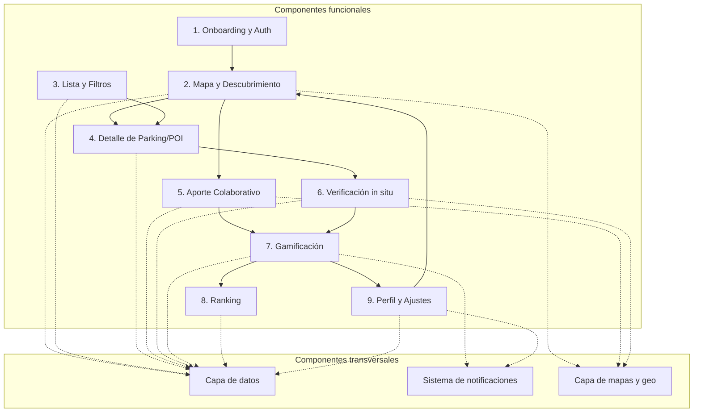
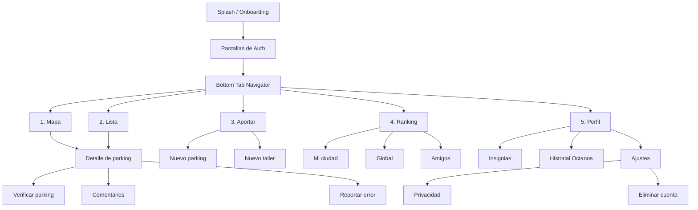

# Descripción de componentes principales — MotoCiudad

> Mapa de los componentes (módulos) que forman la aplicación, qué hace cada uno y cómo se relacionan entre sí.
> Cumple con el componente "Componentes Principales y Sitemaps" del PRD clásico.
> Acompaña a `prd.md` (qué construimos), `arquitectura.md` (con qué stack) y `modelo-datos.md` (cómo se persiste).

**Versión**: 0.1
**Última actualización**: Mayo 2026

---

## 1. Visión general

MotoCiudad se organiza en **9 componentes funcionales** que cubren el ciclo de vida del usuario (descubrir → contribuir → ser reconocido) y **3 componentes técnicos transversales** (auth, datos, infraestructura).

Las flechas continuas indican **flujos de usuario** (cómo navega entre componentes); las punteadas indican **dependencias técnicas**.

---

## 2. Sitemap (jerarquía de navegación)

**Decisiones de navegación clave**:

- 5 tabs como máximo, con el botón central de "Aportar" destacado en amarillo neón. Es la conversión clave del producto.
- Detalle de parking accesible desde Mapa o Lista (rutas equivalentes, mismo destino).
- Verificación es siempre el "siguiente paso" lógico desde el detalle: el botón inferior amarillo "¿Has aparcado aquí?" es la llamada a la acción central.
- Ajustes están enterrados en Perfil (no son acciones frecuentes).

---

## 3. Componentes funcionales

### 3.1 Onboarding y Auth

**Propósito**: convertir un usuario que abre la app por primera vez en una cuenta autenticada con permisos otorgados.

**Pantallas**:
- Pantalla de bienvenida ("Aparcar la moto. Sin volverse loco.") — `iOS_entrada.png`, `Android_entrada.png`.
- Selector de método de auth: Apple, Google o email.
- Pantalla de petición de permiso de ubicación.
- Tutorial breve (3 slides) post-registro.

**Responsabilidades**:
- Mostrar valor del producto en menos de 5 segundos.
- Capturar consentimiento RGPD y términos de servicio.
- Solicitar permisos del sistema (ubicación obligatoria; push diferido).
- Crear o recuperar cuenta vía Supabase Auth.

**Datos que produce**: `auth.users` + fila inicial en `public.users` con `current_level=1`.

**Datos que consume**: ninguno (es el primer componente).

---

### 3.2 Mapa y Descubrimiento

**Propósito**: pantalla principal de la app. El usuario ve dónde están los parkings cerca de él en un mapa interactivo.

**Pantallas**:
- Mapa con pins coloreados — `iOS_Mapa.png`, `Android_Mapa.png`.
- Bottom sheet con info del parking seleccionado (preview).

**Responsabilidades**:
- Centrar inicialmente en la ubicación del usuario.
- Renderizar pins con colores semánticos:
  - Amarillo neón = parking público verificado.
  - Naranja = taller (POI secundario).
  - Gris = parking sin verificar.
- Recargar parkings al desplazar el mapa (carga por bounding box, ver `arquitectura.md` §7.1).
- Aplicar clustering cuando hay > 50 pins en pantalla.
- Permitir cambiar capas (todos / públicos / privados / talleres).

**Datos que consume**: RPC `nearby_parkings(lat, lng, radius)` de Supabase.

**Componentes que enlaza**: tap en un pin → 3.4 Detalle. Botón flotante de aportar → 3.5.

---

### 3.3 Lista y Filtros

**Propósito**: alternativa al mapa para usuarios que prefieren escanear opciones secuencialmente.

**Pantallas**:
- Lista filtrable con cards — `iOS_Lista_filtrable.png`, `Android_Lista_filtrable.png`.

**Responsabilidades**:
- Mostrar parkings ordenados por distancia (default) o por fecha de verificación.
- Filtros chip: Todos / Públicos / Privados / Talleres.
- Cada card muestra: tipo, nombre, barrio, capacidad, distancia, botón "IR" rápido.
- Soporte para `FlashList` (Shopify) por rendimiento con datasets grandes.
- Pull-to-refresh y carga paginada.

**Datos que consume**: misma RPC `nearby_parkings`, mismas filas, distinta presentación.

**Componentes que enlaza**: tap en card → 3.4 Detalle. Botón "IR" → app de mapas externa.

---

### 3.4 Detalle de Parking / POI

**Propósito**: dar al usuario toda la información que necesita antes de ir físicamente al lugar y ofrecerle las acciones posibles.

**Pantallas**:
- Detalle de parking — `iOS_Detalle.png`.
- Detalle de taller (POI secundario) — `iOS__Taller_POI_secundario_.png`.

**Responsabilidades**:
- Cabecera con foto principal y badges de estado (verificado x N, público/privado, gratis/precio, 24h).
- Datos clave: plazas, tipo (en batería/cordón), techo, cámaras.
- Comentario del proponente y galería de fotos.
- Botón "Llévame en Apple Maps / Google Maps" (acción primaria, abre app nativa).
- Botón "¿Has aparcado aquí?" → 3.6 Verificación.
- Acciones secundarias: añadir foto, escribir comentario, reportar error.
- Para talleres: horarios estructurados, especialidades, contacto.

**Datos que consume**: `parkings` con joins a `parking_photos`, `parking_verifications` (count), `comments`, `users` (proponente). O `pois` con sus campos específicos.

**Componentes que enlaza**: 3.6 Verificación, navegación externa, comentarios, reportes.

---

### 3.5 Aporte Colaborativo

**Propósito**: permitir al usuario añadir nuevos parkings o talleres al mapa de la comunidad. Es el motor del crecimiento del dataset.

**Pantallas**:
- Selector de tipo de aporte (parking público / parking privado / taller).
- Formulario por pasos — `iOS_Proponer_parking.png`:
  - Paso 1: confirmar ubicación arrastrando el pin en el mapa.
  - Paso 2: nombre/referencia, características (chips: gratis, 24h, cubierto, cámaras, iluminado, en batería, anclajes).
  - Paso 3: foto recomendada (+3 ★).
- Pantalla de confirmación con +50 Octanos pendientes.

**Responsabilidades**:
- Guardar el parking en estado `pending` hasta verificación de la comunidad.
- Capturar geolocalización exacta sin persistir la del usuario, solo la del parking.
- Subir foto opcional procesada (compresión, eliminación de EXIF).
- Crear `octano_event` con `status='pending'` que pasará a `confirmed` tras verificación.

**Datos que produce**: nueva fila en `parkings` con `status='pending'`. Posible nueva fila en `parking_photos`.

**Componentes que enlaza**: tras enviar → vuelve al mapa con confirmación visual.

---

### 3.6 Verificación in situ

**Propósito**: confirmar que un parking propuesto existe realmente, mediante una foto tomada físicamente en el lugar.

**Pantallas**:
- Cámara con guías y CTA — `iOS_Verificar_parking.png`.

**Responsabilidades**:
- Activar cámara (vista de moto + parking).
- Capturar foto con timestamp.
- Validar geofencing: el GPS del usuario debe estar a ≤ 100 m del parking (regla `gamificacion.md` §2.2).
- Validar timestamp: la foto debe ser de los últimos 5 minutos.
- Otorgar +25 Octanos (+15 extra si es el primer verificador).
- Mover el parking de `status='pending'` a `'verified'` si es la primera verificación válida.

**Datos que produce**: nueva fila en `parking_verifications`. Nueva fila en `parking_photos` con `is_verification=true`. Nuevo `octano_event` con `status='confirmed'`.

**Componente técnico crítico**: la Edge Function `validate-verification` aplica todas las reglas anti-abuso (`arquitectura.md` §6.3).

---

### 3.7 Gamificación

**Propósito**: motivar contribuciones de calidad mediante un sistema de puntos, niveles, insignias y rankings.

Este componente no tiene pantalla propia: es **transversal** y se manifiesta en otras pantallas (perfil, ranking, notificaciones de subida de nivel, badges en el avatar). Su lógica completa está en `gamificacion.md` y su implementación en `modelo-datos.md` §8.

**Subcomponentes**:

- **Octanos**: moneda interna acumulativa. Se otorgan tras acciones puntuables y pasan por validación anti-abuso.
- **Niveles** (1–7): rango público del usuario, sube según Octanos acumulados. Pipiolo → Leyenda del Asfalto.
- **Insignias**: ~20 logros desbloqueables agrupados en 4 familias (Descubrimiento, Verificación, Comunidad, Temáticas).
- **Anti-abuso**: cap diario 200 Octanos, geofence, cooldowns, detección de patrones sospechosos.

**Responsabilidades técnicas**:
- Edge Function `award-octanos`: inserta `octano_event` en transacción, actualiza caché.
- Edge Function `check-badges`: evalúa condiciones de insignias tras cada Octano confirmado.
- Trigger Postgres `refresh_user_octano_caches`: mantiene `total_octanos` y `octanos_this_month`.
- Función `check_level_up`: detecta cruces de umbral y dispara push notification.

**Componentes que dependen de él**: 3.4 (badge "verificado"), 3.5/3.6 (otorga Octanos), 3.8 (ranking), 3.9 (perfil con nivel/insignias).

---

### 3.8 Ranking

**Propósito**: dar reconocimiento público a los top contributors y motivar a otros a participar.

**Pantallas**:
- Pantalla de ranking con podio top 3 + lista — `iOS_Ranking.png`.

**Responsabilidades**:
- Tabs: Madrid (ciudad del usuario) / Global / Amigos.
- Sub-tabs: Octanos del mes (ventana móvil 30 días) / Acumulado total.
- Podio visual con avatar de los 3 primeros.
- Lista paginada del resto, con avatar, nick, nivel, Octanos.
- Respeta `users.ranking_visible`: si está en false, el usuario no aparece (pero sigue acumulando).

**Datos que consume**: materialized views `mv_ranking_global` y `mv_ranking_by_city` (refresco cada 5 min vía cron).

**Componentes que enlaza**: tap en un usuario → su perfil público (3.9 en modo "ver otros").

---

### 3.9 Perfil y Ajustes

**Propósito**: vitrina del progreso del usuario y centro de configuración.

**Pantallas**:
- Perfil propio — `iOS_Perfil.png`, `Android_Perfil.png`.
- Pantallas secundarias: Insignias completas, historial de Octanos, Ajustes, Privacidad, Eliminar cuenta.

**Responsabilidades del perfil propio**:
- Avatar, nick, ciudad, modelo de moto, fecha de registro.
- Nivel actual con barra de progreso al siguiente y "X Octanos para Y".
- Stats: Octanos totales, parkings propuestos, parkings verificados.
- Galería de insignias agrupadas por familia (con desbloqueadas iluminadas y resto en gris).

**Responsabilidades de Ajustes**:
- Editar perfil (display name, ciudad, modelo de moto, avatar).
- Privacidad: toggle "Aparecer en ranking público".
- Notificaciones: toggle de cada tipo de push.
- Eliminar cuenta (RGPD): dispara `delete-account` Edge Function.
- Cerrar sesión.

**Datos que consume**: `users` (propio o ajeno), `octano_events` (paginado para historial), `user_badges` (con join a `badges`).

**Componentes que enlaza**: ajustes lleva a privacidad, notificaciones, RGPD.

---

## 4. Componentes técnicos transversales

### 4.1 Capa de datos

No tiene pantalla; es la **plumbería** que conecta toda la UI con el backend.

**Stack**:
- `@supabase/supabase-js`: cliente que habla con la API REST y Realtime.
- **TanStack Query**: caché, refetch, optimistic updates, manejo de loading/error.
- **Zustand**: estado cliente local (filtros activos, tab actual, sesión).
- **Zod**: validación de schemas y derivación de tipos.

**Patrón**: cada feature tiene `features/<dominio>/api.ts` + `features/<dominio>/hooks.ts`. Los componentes consumen hooks, nunca llaman al cliente Supabase directamente.

---

### 4.2 Sistema de notificaciones

Cubre push notifications transaccionales. **No hay marketing**.

**Stack**:
- **expo-notifications** en cliente (registro de token tras login, permisos diferidos al post-onboarding).
- **Expo Push API** desde Edge Functions (Deno fetch a `https://exp.host/--/api/v2/push/send`).

**Triggers documentados** (ver `infraestructura.md` §11.2):
- Subida de nivel.
- Insignia desbloqueada.
- Tu parking ha sido verificado por la comunidad (+30 Octanos).
- Tu reporte de error fue confirmado (+20 Octanos).

---

### 4.3 Capa de mapas y geo

Cubre todo lo relacionado con localización, distancia, mapas y navegación externa.

**Stack**:
- **react-native-maps**: render de mapas con providers nativos (Apple Maps iOS / Google Maps Android).
- **expo-location**: permisos y obtención de ubicación actual.
- **PostGIS** en backend: `ST_DWithin` para queries por radio, `ST_Distance` para ordenar.
- **deeplinks** a apps externas: `maps://` (Apple Maps), `geo:` (Android), fallback a `https://maps.google.com`.

**Reglas críticas**:
- La ubicación del usuario **nunca se persiste**, solo se usa puntualmente para validar verificaciones.
- Las fotos llegan al servidor con EXIF de geolocalización **eliminado** (procesado en cliente con `expo-image-manipulator`).

---

## 5. Tabla resumen de componentes

| ID | Componente | Tipo | Pantallas principales | Datos que toca |
|---|---|---|---|---|
| 1 | Onboarding y Auth | Funcional | Bienvenida, login | `auth.users`, `users` |
| 2 | Mapa y Descubrimiento | Funcional | Mapa | `parkings`, `pois` |
| 3 | Lista y Filtros | Funcional | Lista | `parkings`, `pois` |
| 4 | Detalle | Funcional | Detalle parking, detalle taller | `parkings`, `parking_photos`, `comments` |
| 5 | Aporte | Funcional | Form proponer | `parkings`, `pois`, `octano_events` |
| 6 | Verificación | Funcional | Cámara | `parking_verifications`, `octano_events` |
| 7 | Gamificación | Transversal | (sin pantalla propia) | `octano_events`, `badges`, `user_badges`, `user_levels` |
| 8 | Ranking | Funcional | Ranking con tabs | `mv_ranking_global`, `mv_ranking_by_city` |
| 9 | Perfil y Ajustes | Funcional | Perfil, ajustes | `users`, `octano_events`, `user_badges` |
| T1 | Capa de datos | Técnico | — | Todas las tablas |
| T2 | Notificaciones | Técnico | — | `users` (push token) |
| T3 | Mapas y geo | Técnico | — | `parkings.location`, `pois.location` |

---

## 6. Mapeo componente ↔ documento canónico

Cada componente está documentado con distinto nivel de detalle en otros documentos del proyecto. Tabla de referencia para encontrar la información rápido:

| Componente | Producto (qué) | Técnica (cómo) | Datos (dónde) |
|---|---|---|---|
| 1. Onboarding y Auth | `prd.md` §9.2 Flujo A | `arquitectura.md` §6.1 | `modelo-datos.md` §5.2 |
| 2. Mapa y Descubrimiento | `prd.md` §8.1, §9.2 Flujo B | `arquitectura.md` §3.4, §7.1 | `modelo-datos.md` §6.2, §12.1 |
| 3. Lista y Filtros | `prd.md` §8.1 | `arquitectura.md` §7.1 | `modelo-datos.md` §6 |
| 4. Detalle | `prd.md` §8.1 | — | `modelo-datos.md` §6 |
| 5. Aporte | `prd.md` §9.2 Flujo C | `arquitectura.md` §5.3 | `modelo-datos.md` §6.2, §8.2 |
| 6. Verificación | `prd.md` §9.2 Flujo D | `arquitectura.md` §6.3 | `modelo-datos.md` §6.4, §9 |
| 7. Gamificación | `gamificacion.md` (todo) | `arquitectura.md` §5.3 | `modelo-datos.md` §8 |
| 8. Ranking | `gamificacion.md` §5 | `arquitectura.md` §7.1 | `modelo-datos.md` §11.2, §11.3 |
| 9. Perfil y Ajustes | `prd.md` §8.5 | `arquitectura.md` §6.4 | `modelo-datos.md` §5.2, §8.4 |

---

## 7. Decisiones cerradas

- ✅ 5 tabs en bottom navigator, con "Aportar" central destacado.
- ✅ Mapa y Lista son vistas alternativas del mismo dataset.
- ✅ Verificación es siempre acción siguiente al detalle (no oculta en menús).
- ✅ Gamificación es transversal, no es una pantalla.
- ✅ Ajustes están enterrados en Perfil.

## 8. Decisiones pendientes

- ⏳ ¿Hay onboarding tutorial post-registro o se descubre orgánicamente? (recomendado: 3 slides cortos).
- ⏳ ¿El detalle de parking permite edición por proponente solo o por cualquier nivel ≥ Cartógrafo?
- ⏳ ¿Búsqueda por texto (calle, nombre) además de mapa? Probablemente sí en v1.1, no en MVP.

---

## 9. Documentos relacionados

- `prd.md` — visión y alcance.
- `arquitectura.md` — stack y decisiones técnicas.
- `modelo-datos.md` — schema y queries.
- `gamificacion.md` — reglas de Octanos y niveles.
- `infraestructura.md` — entornos y deploy.
- `CLAUDE.md`, `AGENTS.md` — instrucciones para Claude Code y subagentes.
