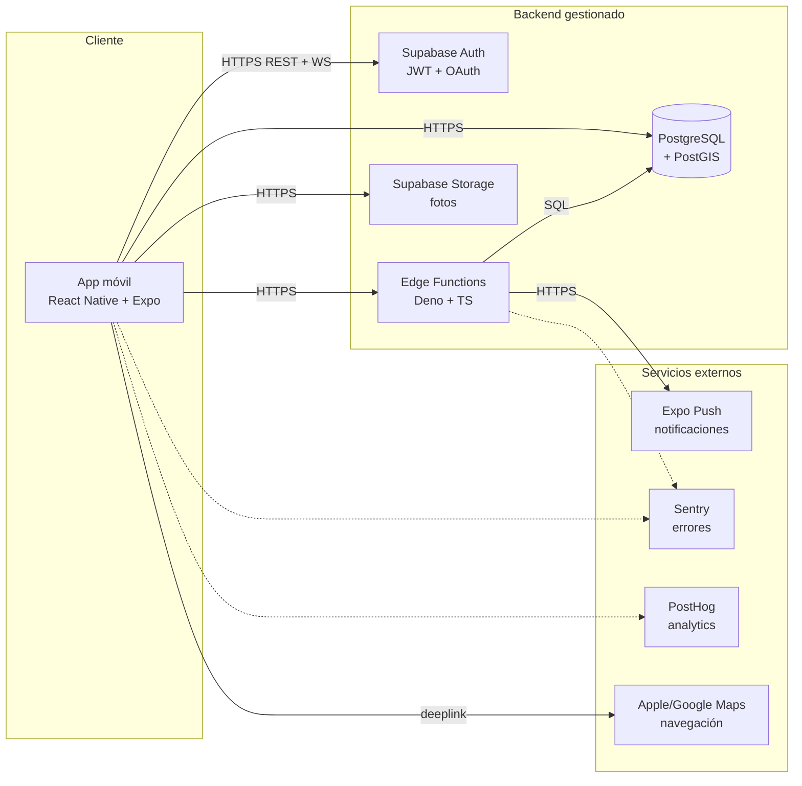
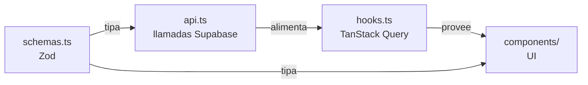
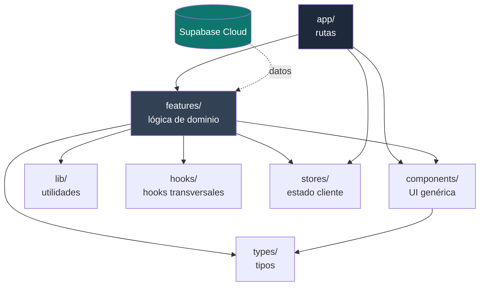
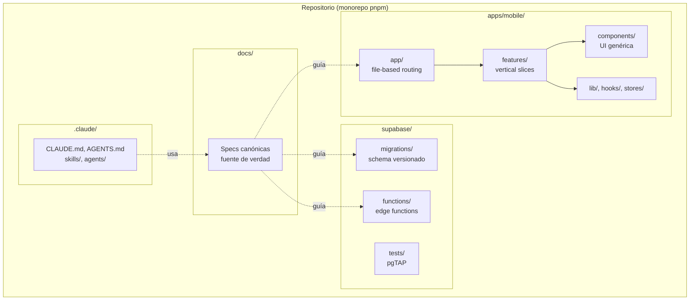

# Estructura del proyecto — MotoCiudad

> Descripción de alto nivel del proyecto, organización del repositorio y patrones arquitectónicos aplicados.
> Acompaña a `arquitectura.md` (decisiones técnicas) y `componentes-principales.md` (módulos funcionales) explicando **dónde vive cada cosa y por qué está donde está**.

**Versión**: 0.1
**Última actualización**: Mayo 2026

---

## 1. Descripción de alto nivel

**MotoCiudad** es una aplicación móvil colaborativa para motoristas urbanos que les permite descubrir, proponer y verificar parkings de moto en su ciudad. La aplicación se sostiene en una comunidad gamificada y un dataset construido por los propios usuarios.

Técnicamente, el proyecto se compone de **dos piezas principales** orquestadas en un **monorepo**:

1. **Una aplicación móvil** (iOS y Android) escrita en React Native + Expo + TypeScript.
2. **Un backend gestionado** sobre Supabase (PostgreSQL + Auth + Storage + Edge Functions), sin servidor propio que mantener.

El stack se elige con tres principios:

- **TypeScript end-to-end**: el mismo lenguaje en cliente, edge functions y scripts. Reduce contexto cognitivo y facilita la generación de código asistida por IA (Claude Code).
- **Backend-as-a-Service (BaaS)**: en lugar de escribir un backend tradicional, se delega en Supabase la mayoría de la infraestructura (auth, almacenamiento, base de datos, funciones). El esfuerzo se concentra en producto.
- **Spec-Driven Development**: la documentación (`prd.md`, `arquitectura.md`, etc.) es la fuente de verdad. Cualquier divergencia entre código y especificación se considera un bug.

---

## 2. Vista panorámica

A muy alto nivel, el sistema tiene tres bloques que conviven y se comunican entre sí:



**Lectura del diagrama**:
- Las flechas continuas son **comunicación funcional** crítica.
- Las punteadas son **observabilidad** (errores, métricas).
- La app móvil es **el único cliente**: no hay web pública en el MVP.
- Las **escrituras críticas** (verificaciones, otorgar Octanos) pasan obligatoriamente por **Edge Functions**; las **lecturas** van directas a PostgreSQL con RLS aplicada.

---

## 3. Monorepo: por qué un solo repositorio

El proyecto vive en un **monorepo** (todo el código en un único repo Git) gestionado con **pnpm workspaces**. Decisión razonada:

| Ventaja | En MotoCiudad |
|---|---|
| Tipos compartidos | Los tipos generados desde el schema de Supabase se usan tanto en la app móvil como en las Edge Functions sin sincronización manual |
| CI unificado | Un solo flujo de GitHub Actions cubre app, backend y deployment |
| Refactor cross-cutting | Cambiar el nombre de una columna en SQL puede romper a la vez la app, las edge functions y los tests; verlo todo junto previene PRs incoherentes |
| Documentación centralizada | `docs/` con todos los PRD vive junto al código que describe |
| Versión coordinada | Si la API cambia, el cliente que la consume cambia en el mismo commit |

Trade-off aceptado: el repo es ligeramente más grande y `pnpm install` toca más cosas. A esta escala es irrelevante.

---

## 4. Estructura del repositorio (visión completa)

```
motociudad/
├── apps/
│   └── mobile/                    ← Aplicación React Native + Expo
│
├── supabase/                      ← Backend gestionado por Supabase CLI
│
├── docs/                          ← Toda la documentación del proyecto
│
├── .github/
│   └── workflows/                 ← GitHub Actions (CI/CD)
│
├── .claude/
│   ├── agents/                    ← Subagentes de Claude Code
│   └── skills/                    ← Skills personalizadas del proyecto
│
├── package.json                   ← Workspace root (pnpm)
├── pnpm-workspace.yaml
├── tsconfig.base.json             ← Tipos compartidos
└── README.md
```

**Carpetas raíz, una a una**:

| Carpeta | Propósito | Patrón |
|---|---|---|
| `apps/mobile/` | Aplicación móvil. Es lo que se compila a iOS/Android | Feature-Based + File-Based Routing |
| `supabase/` | Schema de la base de datos, Edge Functions, tests SQL. Es lo que se sincroniza con Supabase Cloud | Migration-First |
| `docs/` | Documentación canónica en Markdown (PRD, arquitectura, modelo de datos, etc.) | Spec-Driven Development |
| `.github/workflows/` | Pipelines de CI/CD (tests, build, deploy, keepalive, backup) | GitOps |
| `.claude/` | Configuración para Claude Code: subagentes (`agents/`) y procedimientos repetitivos (`skills/`) | AI-Assisted Development |

---

## 5. Estructura de la app móvil (`apps/mobile/`)

Aquí vive el grueso del código de cliente. Estructura completa:

```
apps/mobile/
├── app/                           ← Rutas (Expo Router file-based)
│   ├── (auth)/
│   │   ├── login.tsx
│   │   ├── register.tsx
│   │   └── _layout.tsx
│   ├── (tabs)/
│   │   ├── map.tsx                ← Tab: Mapa
│   │   ├── list.tsx               ← Tab: Lista
│   │   ├── contribute.tsx         ← Tab: Aportar
│   │   ├── ranking.tsx            ← Tab: Ranking
│   │   ├── profile.tsx            ← Tab: Perfil
│   │   └── _layout.tsx            ← Configuración de tabs
│   ├── parking/
│   │   └── [id].tsx               ← Detalle dinámico
│   ├── verify/
│   │   └── [parkingId].tsx        ← Verificación in situ
│   ├── _layout.tsx                ← Layout raíz (providers)
│   └── index.tsx                  ← Splash / redirección inicial
│
├── components/                    ← UI reusable agnóstica de dominio
│   ├── Button.tsx
│   ├── Card.tsx
│   ├── BadgeIcon.tsx
│   ├── PinMarker.tsx
│   ├── BottomSheet.tsx
│   └── __tests__/
│
├── features/                      ← Lógica de dominio agrupada
│   ├── parkings/
│   │   ├── api.ts                 ← Llamadas a Supabase
│   │   ├── hooks.ts               ← Hooks TanStack Query
│   │   ├── schemas.ts             ← Zod schemas + tipos
│   │   ├── components/            ← Componentes específicos del dominio
│   │   │   ├── ParkingCard.tsx
│   │   │   ├── ParkingMapPin.tsx
│   │   │   └── ParkingFilters.tsx
│   │   └── __tests__/
│   ├── auth/
│   ├── verifications/
│   ├── gamification/              ← Octanos, niveles, insignias
│   ├── ranking/
│   ├── profile/
│   ├── pois/                      ← Talleres
│   └── notifications/
│
├── lib/                           ← Utilidades genéricas (sin dominio)
│   ├── supabase.ts                ← Cliente Supabase configurado
│   ├── distance.ts                ← Cálculo de distancia
│   ├── format.ts                  ← Formateo de fechas, números
│   ├── geo.ts                     ← Helpers de geolocalización
│   ├── deeplinks.ts               ← Apple Maps / Google Maps
│   └── __tests__/
│
├── hooks/                         ← Hooks reutilizables transversales
│   ├── useLocation.ts
│   ├── useColorScheme.ts
│   └── useDebounce.ts
│
├── stores/                        ← Estado cliente (Zustand)
│   ├── filtersStore.ts
│   ├── sessionStore.ts
│   └── uiStore.ts
│
├── types/                         ← Tipos TypeScript
│   ├── database.ts                ← Generado desde Supabase (no editar)
│   └── domain.ts                  ← Tipos de dominio (alias y extensiones)
│
├── locales/                       ← i18n
│   └── es.json
│
├── assets/                        ← Imágenes, fonts, iconos
│   ├── fonts/
│   └── images/
│
├── app.config.ts                  ← Configuración de Expo
├── tailwind.config.js             ← NativeWind / tema dark
├── tsconfig.json
└── package.json
```

### 5.1 Lógica detrás de cada carpeta

| Carpeta | Qué contiene | Qué NO contiene |
|---|---|---|
| `app/` | Solo rutas. Cada archivo `.tsx` es una pantalla accesible vía URL/navegación | Lógica reutilizable, queries, schemas |
| `components/` | Componentes de UI **sin conocimiento del dominio**: botones, cards genéricas, iconos | Lógica de parkings, llamadas a Supabase |
| `features/<dominio>/` | Todo lo que pertenece a un dominio: API, hooks, schemas, componentes específicos | Componentes genéricos, utilidades sin dominio |
| `lib/` | Funciones puras, helpers, configuración de clientes externos | Lógica de UI, llamadas con efectos a Supabase |
| `hooks/` | Hooks React reutilizables y agnósticos de dominio | Hooks específicos de parkings o gamificación (esos van a `features/`) |
| `stores/` | Estado **del cliente** (Zustand): filtros activos, modales abiertos, preferencias UI | Estado servidor (eso es de TanStack Query, dentro de `features/`) |
| `types/` | Tipos TypeScript globales | Schemas de validación (eso es Zod en `features/<dominio>/schemas.ts`) |

### 5.2 Anatomía de una feature

Cada subcarpeta de `features/` sigue el mismo patrón. Ejemplo con `features/parkings/`:

```
features/parkings/
├── api.ts            ← qué llamadas hace al backend
├── hooks.ts          ← cómo el componente accede a esos datos
├── schemas.ts        ← qué forma tienen los datos
├── components/       ← cómo se ven en pantalla
└── __tests__/        ← pruebas que blindan todo lo anterior
```

Esta separación permite leer una feature de arriba a abajo y entender el **flujo completo de datos**: forma → llamada → cache → consumo → render.



---

## 6. Estructura del backend (`supabase/`)

```
supabase/
├── migrations/                    ← Schema versionado
│   ├── 20260101000001_extensions.sql
│   ├── 20260101000002_enums.sql
│   ├── 20260101000003_user_levels.sql
│   ├── 20260101000004_users.sql
│   ├── 20260101000005_friendships.sql
│   ├── 20260102000001_parkings.sql
│   ├── 20260102000002_parking_photos.sql
│   ├── 20260102000003_parking_verifications.sql
│   ├── 20260102000004_parking_reports.sql
│   ├── 20260102000005_comments.sql
│   ├── 20260103000001_pois.sql
│   ├── 20260104000001_octano_events.sql
│   ├── 20260104000002_badges.sql
│   ├── 20260104000003_user_badges.sql
│   ├── 20260105000001_views_materialized.sql
│   ├── 20260105000002_functions.sql
│   ├── 20260106000001_rls_policies.sql
│   ├── 20260106000002_storage_policies.sql
│   └── 20260107000001_cron_jobs.sql
│
├── functions/                     ← Edge Functions (Deno + TypeScript)
│   ├── validate-verification/
│   │   ├── index.ts               ← Entrada de la función
│   │   ├── validators.ts          ← Reglas de negocio (geofence, cap)
│   │   └── __tests__/
│   ├── award-octanos/
│   ├── check-badges/
│   ├── compute-monthly-ranking/
│   ├── process-photo-upload/
│   ├── delete-account/
│   └── _shared/                   ← Código compartido entre funciones
│       ├── supabase.ts
│       └── errors.ts
│
├── tests/                         ← Tests SQL (pgTAP)
│   ├── rls/
│   │   ├── parkings.test.sql
│   │   ├── octano_events.test.sql
│   │   └── ...
│   └── sql/
│       ├── nearby_parkings.test.sql
│       ├── check_level_up.test.sql
│       └── ...
│
├── seed.sql                       ← Datos iniciales (niveles, insignias, demo)
└── config.toml                    ← Configuración del proyecto Supabase
```

### 6.1 Lógica detrás de cada carpeta

| Carpeta | Patrón | Reglas |
|---|---|---|
| `migrations/` | Migration-First, forward-only | Cada cambio de schema = un archivo nuevo. Nunca editar migraciones ya aplicadas en producción. |
| `functions/` | Una Edge Function = una responsabilidad | Naming kebab-case. Cada función tiene su carpeta con `index.ts`, archivos auxiliares y tests. |
| `tests/` | pgTAP + Vitest (Deno) | Las RLS y funciones SQL críticas deben tener test SQL. Las Edge Functions tienen tests unitarios separados. |
| `_shared/` | Código común entre funciones | Cliente Supabase con service role, tipos de error, helpers de respuesta JSON. |

---

## 7. Patrones arquitectónicos aplicados

El proyecto combina varios patrones bien establecidos. Cada uno se explica con una definición breve, cómo se aplica en MotoCiudad y dónde verlo en el código.

### 7.1 Backend-as-a-Service (BaaS)

> El backend (autenticación, base de datos, almacenamiento, funciones serverless) lo provee un servicio gestionado en lugar de escribirlo desde cero.

**En MotoCiudad**: Supabase es nuestro BaaS. No hay servidor Node.js ni Laravel propio. La app móvil habla directamente con Supabase mediante su SDK; las operaciones críticas (validar Octanos) pasan por Edge Functions también alojadas allí.

**Ventaja para un proyecto académico**: foco en producto, no en infra.

### 7.2 Feature-Based Architecture (Vertical Slicing)

> El código se organiza por **dominio funcional** (parkings, gamificación, ranking) en lugar de por **tipo de archivo** (todos los hooks juntos, todas las APIs juntas).

**En MotoCiudad**: la carpeta `apps/mobile/features/` agrupa todo lo relacionado con un dominio en su propia carpeta.

**Por qué**: cuando trabajas en una feature, todo lo que necesitas está cerca. Cuando borras una feature, borras una carpeta entera. Reduce el ruido cognitivo.

**Contraste con la alternativa**:

```
❌ Por tipo (Layered tradicional):       ✅ Por feature (vertical slice):
  /api/parkings.ts                          /features/parkings/
  /api/auth.ts                                api.ts
  /api/ranking.ts                             hooks.ts
  /hooks/useParkings.ts                       components/
  /hooks/useAuth.ts                         /features/auth/
  /hooks/useRanking.ts                        api.ts
  /components/parkings/                       hooks.ts
  /components/auth/                           components/
```

### 7.3 Layered Architecture (dentro de cada feature)

> Dentro de cada feature, las dependencias fluyen en una sola dirección: schemas → API → hooks → componentes.

**En MotoCiudad**: ver §5.2.

**Regla**: un componente nunca llama a Supabase directamente, siempre pasa por un hook. Un hook no construye URLs ni payloads, eso es trabajo de la capa API. Esto hace los componentes triviales de testear (basta con mockear el hook).

### 7.4 Separation of Concerns: estado cliente vs servidor

> El estado de la app no es uno solo. Es **dos**: lo que vive en el servidor (parkings, perfil) y lo que vive solo en el cliente (filtros activos, tab seleccionado).

**En MotoCiudad**:

| Tipo de estado | Herramienta | Ejemplos |
|---|---|---|
| Estado servidor | TanStack Query | Lista de parkings, perfil del usuario, ranking |
| Estado cliente | Zustand | Filtros activos del mapa, tab actual, modal abierto |

**Por qué importa**: TanStack Query gestiona caché, refetch e invalidación de forma idiomática. Zustand es minimalista para lo que el servidor no debe saber.

### 7.5 File-Based Routing (Expo Router)

> La estructura de carpetas en `app/` define automáticamente las rutas de navegación. No hay archivo central que declare rutas.

**En MotoCiudad**:
- `app/(tabs)/map.tsx` → ruta `/map` accesible desde el tab Mapa.
- `app/parking/[id].tsx` → ruta dinámica `/parking/123`.
- Los paréntesis `(auth)` y `(tabs)` son **grupos de ruta** que no aparecen en la URL pero permiten compartir layout.

**Por qué**: convención sobre configuración. Quien viene de Next.js encuentra esto familiar; quien viene de Laravel piensa en rutas declarativas y debe adaptarse, pero el modelo es el mismo (URL → archivo).

### 7.6 Spec-Driven Development

> La documentación canónica (PRD, arquitectura, modelo de datos) **no es un subproducto** del código: es la fuente de verdad. El código se ajusta a la spec, no al revés.

**En MotoCiudad**: la carpeta `docs/` contiene los PRD que rigen el proyecto. `CLAUDE.md` instruye a Claude Code a leer estos documentos antes de cualquier cambio. Si el código y la documentación divergen, es un bug que se corrige en el mismo PR (delegado al subagente `prd-keeper`).

**Por qué con IA**: cuanto más precisa la spec, mejor el código que genera Claude Code. Una spec ambigua produce código ambiguo.

### 7.7 Migration-First Database

> El schema de la base de datos vive como código en migraciones versionadas, no se modifica directamente desde un panel.

**En MotoCiudad**: `supabase/migrations/` contiene archivos `.sql` numerados secuencialmente. Aplicarlos en orden produce el schema actual. Cambios = migraciones nuevas, nunca edición de las anteriores.

**Por qué**: el schema es trazable, reproducible y versionable. Cualquier developer puede recrear el estado de la BD desde cero (`supabase db reset`).

### 7.8 Defense in Depth (validación por capas)

> Los datos se validan en **múltiples capas**: cliente, Edge Function, base de datos. Si una capa falla, las demás contienen el daño.

**En MotoCiudad** (ejemplo: verificar un parking):

| Capa | Validación |
|---|---|
| Cliente (RN) | Form Zod: campos requeridos, formato de coordenadas |
| Edge Function | Reglas de negocio: geofence ≤ 100m, foto ≤ 5min, cap diario, cooldown |
| Postgres (RLS) | Policies que impiden insertar verificaciones a usuarios no autenticados o en parkings ajenos |
| Postgres (constraints) | UNIQUE (parking_id, verified_by), CHECK constraints |

**Por qué**: nunca confiar en una sola capa. Un atacante que evite el cliente seguirá tropezando con la Edge Function; quien evite la Edge Function seguirá topando con RLS.

### 7.9 Monorepo con workspaces

> Múltiples paquetes/proyectos relacionados viven en el mismo repositorio Git, gestionados por una herramienta de workspace (pnpm).

**En MotoCiudad**: `apps/mobile/` y `supabase/` comparten tipos generados, configuración de TypeScript base (`tsconfig.base.json`) y CI.

### 7.10 AI-Assisted Development (Claude Code)

> Una capa específica del proyecto (`.claude/`) contiene instrucciones, subagentes y skills personalizadas para que Claude Code entienda las convenciones y procedimientos del proyecto.

**En MotoCiudad**: `CLAUDE.md` y `AGENTS.md` definen el contrato de trabajo con la IA. Los subagentes (`prd-keeper`, `migration-builder`, etc.) aplican procedimientos repetitivos.

**Patrón emergente** en proyectos modernos. No tiene un nombre académico consolidado todavía, pero refleja una realidad: el código y la documentación que la IA consume merecen el mismo nivel de cuidado que el código que se ejecuta.

---

## 8. Diagrama de dependencias entre capas

Visualización de cómo fluyen las dependencias dentro de la app móvil:



**Reglas de dependencia (no negociables)**:

1. `app/` puede depender de cualquier carpeta interna.
2. `features/<dominio>/` puede depender de `lib/`, `hooks/`, `stores/`, `types/`, `components/` y de **otras features solo a través de su API pública** (su `api.ts` o `hooks.ts`).
3. `components/` solo puede depender de `lib/`, `hooks/` y `types/`.
4. `lib/` no puede depender de nada salvo de paquetes externos. Es el nivel más bajo.
5. **Prohibido**: que `components/` o `lib/` importen de `features/` (sería una dependencia invertida).

---

## 9. Convenciones del proyecto

### 9.1 Idiomas

| Contexto | Idioma |
|---|---|
| Código (variables, funciones, comentarios) | Inglés |
| UI visible al usuario (copy, mensajes de error mostrados) | Castellano |
| Documentación en `docs/` | Castellano |
| Mensajes de commit | Castellano (Conventional Commits) |

### 9.2 Naming

- **Archivos de componentes**: PascalCase (`ParkingCard.tsx`).
- **Archivos de hooks/utils**: camelCase (`useNearbyParkings.ts`, `formatDistance.ts`).
- **Archivos de rutas (Expo Router)**: kebab-case o lowercase según convención del framework (`profile.tsx`, `[id].tsx`).
- **Componentes React**: PascalCase (`<ParkingCard />`).
- **Hooks**: camelCase con prefijo `use` (`useNearbyParkings`).
- **Tablas SQL**: snake_case en plural (`parkings`, `octano_events`).
- **Columnas SQL**: snake_case (`created_at`, `verified_by`).
- **Edge Functions**: kebab-case (`validate-verification`, `award-octanos`).
- **Subagentes Claude Code**: kebab-case (`prd-keeper`, `migration-builder`).

### 9.3 Imports

Imports absolutos vía `@/` configurado en `tsconfig.json`:

```typescript
// ✅ Correcto
import { ParkingCard } from '@/features/parkings/components/ParkingCard';
import { formatDistance } from '@/lib/distance';

// ❌ Evitar paths relativos largos
import { ParkingCard } from '../../../features/parkings/components/ParkingCard';
```

---

## 10. Cómo añadir una feature nueva (ejemplo práctico)

Para que la teoría aterrice: supongamos que añadimos una feature **"Parkings favoritos"** (el usuario marca parkings con estrella). El recorrido completo:

### 10.1 Documentación primero

1. Actualizar `prd.md`:
   - Añadir user story en §8.
   - Reflejar en sitemap si aparece en alguna pantalla.
2. Actualizar `componentes-principales.md`:
   - Añadir el componente "Favoritos" o anclarlo como subcomponente de "Perfil".
3. Si toca puntuación: actualizar `gamificacion.md`.

### 10.2 Schema (delegado al subagente `migration-builder`)

4. Crear migración en `supabase/migrations/`:

```sql
-- 20260301000001_user_favorites.sql
CREATE TABLE user_favorites (
  user_id UUID REFERENCES users(id) ON DELETE CASCADE,
  parking_id UUID REFERENCES parkings(id) ON DELETE CASCADE,
  created_at TIMESTAMPTZ DEFAULT now(),
  PRIMARY KEY (user_id, parking_id)
);

ALTER TABLE user_favorites ENABLE ROW LEVEL SECURITY;
CREATE POLICY "favorites_own" ON user_favorites
  FOR ALL TO authenticated USING (user_id = auth.uid());
```

5. Crear test pgTAP en `supabase/tests/rls/user_favorites.test.sql`.
6. Actualizar `modelo-datos.md` con la nueva tabla y diagrama Mermaid.

### 10.3 Feature en la app móvil

7. Crear `apps/mobile/features/favorites/`:

```
features/favorites/
├── api.ts            ← addFavorite, removeFavorite, listFavorites
├── hooks.ts          ← useFavorites, useToggleFavorite
├── schemas.ts        ← Zod schema y tipos
├── components/
│   └── FavoriteButton.tsx
└── __tests__/
```

8. Añadir el botón estrella en el detalle de parking (que ya existe en `app/parking/[id].tsx`).

### 10.4 Tests

9. Tests unitarios en `features/favorites/__tests__/`.
10. Test E2E con Maestro (`.maestro/favorites.yaml`) si es flujo crítico.

### 10.5 Cierre

11. PR con todos los cambios anteriores en un solo merge.
12. CI verde (mobile-ci, supabase-ci).
13. Documentación actualizada (`prd-keeper` valida coherencia).

**Tiempo estimado** con Claude Code asistiendo: 2-4 horas para feature pequeña como esta.

---

## 11. Resumen visual de la arquitectura



---

## 12. Decisiones cerradas

- ✅ Monorepo con pnpm workspaces.
- ✅ Frontend organizado por features (vertical slicing).
- ✅ File-based routing con Expo Router.
- ✅ Layered architecture dentro de cada feature.
- ✅ Migration-first para el schema de BD.
- ✅ Defense in depth: validación en cliente, Edge Function y RLS.
- ✅ Documentación en `docs/` como fuente de verdad.

## 13. Decisiones pendientes

- ⏳ ¿Introducir Turborepo cuando crezca el monorepo, o quedarse con pnpm workspaces?
- ⏳ ¿Separar `features/` por subdominios cuando alguno crezca demasiado (ej. `features/gamification/octanos/`, `features/gamification/badges/`)?
- ⏳ ¿Mover algunos helpers de `lib/` a un paquete `@motociudad/utils` reutilizable si en el futuro hay segunda app?

---

## 14. Documentos relacionados

- `prd.md` — qué construimos.
- `arquitectura.md` — decisiones técnicas.
- `componentes-principales.md` — módulos funcionales.
- `modelo-datos.md` — schema de BD.
- `testing.md` — estrategia de tests.
- `infraestructura.md` — entornos y deploy.
- `CLAUDE.md`, `AGENTS.md` — instrucciones para Claude Code.
