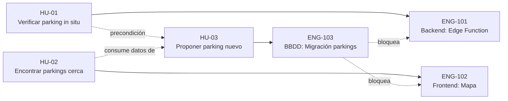
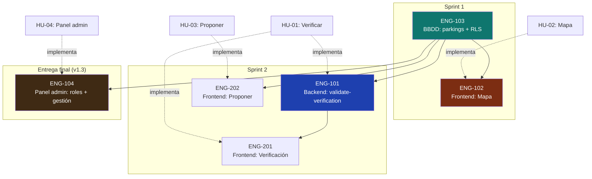

# Historias de usuario y tickets de trabajo — MotoCiudad

> Documentación de 3 historias de usuario principales y 3 tickets de trabajo (backend, frontend, base de datos) que las implementan.
> Acompaña al PRD aplicando metodología ágil con buenas prácticas de redacción.

**Versión**: 0.1
**Última actualización**: Mayo 2026

---

## 1. Introducción

### 1.1 Diferencia entre historia y ticket

Aunque a menudo se confunden, son artefactos distintos con propósitos diferentes:

| Concepto | Perspectiva | Audiencia | Lenguaje |
|---|---|---|---|
| **Historia de usuario** | Valor para el usuario final | Producto + equipo | Lenguaje natural, sin jerga técnica |
| **Ticket de trabajo** | Tarea técnica concreta | Desarrolladores | Lenguaje técnico, paths, comandos |

Una historia de usuario puede generar **uno o varios tickets**: por ejemplo, la historia "verificar un parking" se materializa en un ticket de backend (Edge Function), uno de frontend (pantalla de cámara) y posiblemente uno de base de datos (índices o constraints).

### 1.2 Buenas prácticas aplicadas

Para las **historias de usuario** se sigue:

- **Formato Connextra**: "*Como [rol], quiero [funcionalidad] para [beneficio]*".
- **Criterios INVEST**: Independientes, Negociables, Valiosas, Estimables, Pequeñas, Testables.
- **Criterios de aceptación en formato Gherkin** (Given/When/Then), trazables 1:1 con tests E2E.
- **Definition of Done** explícita y compartida.

Para los **tickets de trabajo** se sigue:

- Título corto que describe la acción técnica.
- Contexto que justifica el porqué (con enlace a historia de usuario).
- Lista de subtareas verificables.
- Archivos afectados explícitos.
- Criterios de aceptación técnica (no de negocio).
- Definition of Done específica del ticket.
- Estimación temporal y dependencias.

### 1.3 Trazabilidad



---

## 2. Historias de Usuario

### Historia de Usuario 1

```
ID:           HU-01
Título:       Verificar un parking in situ
Épica:        Gamificación y aporte colaborativo
Prioridad:    Alta (MUST)
Estimación:   8 story points
Sprint:       2
```

#### 2.1.1 Narrativa

> **Como** motorista que acaba de aparcar la moto en un parking propuesto por otro usuario,
> **quiero** confirmar in situ con una foto que el parking realmente existe,
> **para** ayudar a la comunidad a confiar en el dato y ganar Octanos por mi contribución.

#### 2.1.2 Descripción extendida

El usuario llega a un parking que aparece como "sin verificar" (pin gris en el mapa). Abre el detalle del parking y pulsa el botón inferior amarillo "¿Has aparcado aquí?". La app abre la cámara en modo guiado, le pide que encuadre su moto y el parking, y captura la foto. La app valida automáticamente que la ubicación GPS del usuario está dentro del radio del parking (≤ 100 m) y que la foto es reciente (≤ 5 minutos). Si la validación pasa, otorga +25 Octanos al usuario (+15 extra si es el primer verificador), y el parking pasa a estar verificado.

Esta es la acción más valiosa del sistema: garantiza la calidad del dataset y desbloquea la confianza de la comunidad.

#### 2.1.3 Criterios de aceptación

```gherkin
Funcionalidad: Verificación de parking in situ

  Escenario: Verificación válida dentro del radio
    Dado que estoy autenticado como un usuario con nivel ≥ 2 (Rodador)
    Y existe un parking en estado "pending" o "verified" propuesto por otro usuario
    Y mi ubicación GPS está a ≤ 100 metros del parking
    Cuando pulso "¿Has aparcado aquí?" y tomo una foto
    Entonces la verificación se registra correctamente
    Y recibo +25 Octanos confirmados al instante
    Y veo un mensaje de confirmación con el total de Octanos ganados

  Escenario: Soy el primer verificador
    Dado que el parking nunca había sido verificado
    Cuando completo una verificación válida
    Entonces recibo un bonus adicional de +15 Octanos (40 totales)
    Y el parking pasa de "pending" a "verified"

  Escenario: Estoy demasiado lejos del parking
    Dado que mi ubicación GPS está a más de 100 metros del parking
    Cuando intento verificar
    Entonces la operación se rechaza con código GEOFENCE_FAIL
    Y veo un mensaje "Estás demasiado lejos del parking"
    Y no se otorgan Octanos

  Escenario: La foto no es reciente
    Dado que la foto fue tomada hace más de 5 minutos
    Cuando intento enviar la verificación
    Entonces la operación se rechaza con código STALE_PHOTO
    Y se me pide tomar una foto nueva

  Escenario: Ya verifiqué este parking
    Dado que ya verifiqué este parking en una sesión anterior
    Cuando intento verificarlo de nuevo
    Entonces la operación se rechaza con código ALREADY_VERIFIED
    Y veo un mensaje informativo

  Escenario: Intento auto-verificar mi propio parking
    Dado que yo soy el proponente del parking
    Cuando intento verificarlo
    Entonces la opción no se muestra en el detalle
    Y si intento la operación directamente, se rechaza con SELF_VERIFICATION_FORBIDDEN

  Escenario: He alcanzado el cap diario
    Dado que ya he ganado 200 Octanos en las últimas 24 horas
    Cuando intento verificar un parking
    Entonces la operación se rechaza con DAILY_CAP_REACHED
    Y se me indica cuándo se reinicia el contador
```

#### 2.1.4 Notas y consideraciones

- La pantalla de cámara debe forzar el uso de la cámara trasera (no selfie).
- El timestamp de la foto se obtiene del momento de la captura, no del momento de envío (importante por si la red falla y se reintenta).
- El EXIF de geolocalización se elimina en el cliente antes de subir la foto a Storage (privacidad).
- Si el GPS aún no tiene fix preciso (precisión > 50 m), advertir al usuario y bloquear el envío.
- Tras la verificación exitosa, comprobar si el usuario ha cruzado un umbral de nivel y disparar la animación celebratoria correspondiente.

#### 2.1.5 Definition of Done

- [ ] Tests E2E con Maestro cubriendo el camino feliz y al menos un caso de error.
- [ ] Tests unitarios de la Edge Function cubriendo los 5 códigos de error documentados.
- [ ] Telemetría: evento `parking_verified` enviado a PostHog tras éxito.
- [ ] Documentación actualizada: `gamificacion.md` §2.1 si los Octanos cambian, `componentes-principales.md` §3.6.
- [ ] Demostración en review: verificación real con dispositivo físico en parking de prueba.

#### 2.1.6 Referencias

- `prd.md` §9.2 Flujo D
- `gamificacion.md` §2.2 (reglas anti-abuso)
- `arquitectura.md` §6.3
- `especificacion-api.md` §2.3 (endpoint)
- Mock: `iOS_Verificar_parking.png`

---

### Historia de Usuario 2

```
ID:           HU-02
Título:       Encontrar parkings cercanos a mi ubicación
Épica:        Descubrimiento
Prioridad:    Alta (MUST)
Estimación:   13 story points
Sprint:       1
```

#### 2.2.1 Narrativa

> **Como** motorista que llega a una zona en la que no conozco dónde aparcar,
> **quiero** ver en un mapa los parkings de moto a menos de 2 km a la redonda con sus características principales,
> **para** elegir el más adecuado y llegar sin perder tiempo dando vueltas.

#### 2.2.2 Descripción extendida

Al abrir la app, el primer pantallazo es el mapa centrado en la ubicación del usuario. Sobre el mapa aparecen pins coloreados según el tipo (público amarillo, privado gris, taller naranja) y según el estado de verificación. Al desplazar el mapa, se cargan automáticamente los parkings que entran en el viewport. Al pulsar un pin, se despliega un bottom sheet con el preview del parking (foto, distancia, plazas, badge de verificado) y dos botones: "Llévame" (abre la app de mapas nativa) y "Detalles".

#### 2.2.3 Criterios de aceptación

```gherkin
Funcionalidad: Mapa de parkings cercanos

  Escenario: Carga inicial centrada en mi ubicación
    Dado que tengo permiso de ubicación concedido
    Cuando abro la app y el mapa carga
    Entonces el mapa se centra en mis coordenadas con un zoom apropiado para una ciudad
    Y se muestran los parkings verificados a 2 km a la redonda
    Y mi ubicación se indica con un punto azul

  Escenario: Pins coloreados por tipo y estado
    Cuando el mapa se renderiza
    Entonces los parkings públicos verificados aparecen en amarillo neón
    Y los parkings privados aparecen en gris oscuro
    Y los talleres aparecen en naranja
    Y los parkings sin verificar aparecen con un borde discontinuo

  Escenario: Desplazo el mapa para explorar otra zona
    Dado que estoy viendo el mapa
    Cuando desplazo el mapa más de 500 metros desde el centro
    Entonces se vuelve a consultar la API con el nuevo viewport
    Y los pins se actualizan sin recargar la pantalla completa
    Y la consulta tarda menos de 500 ms en p95

  Escenario: Hay muchos pins en pantalla
    Dado que en el viewport hay más de 50 parkings
    Cuando se renderiza el mapa
    Entonces los pins se agrupan visualmente en clusters numerados
    Y al pulsar un cluster, el zoom aumenta para revelar los pins individuales

  Escenario: Selecciono un parking
    Cuando pulso un pin en el mapa
    Entonces aparece un bottom sheet con la foto principal, nombre, distancia y plazas
    Y se muestran los botones "Llévame" y "Detalles"

  Escenario: Pulso "Llévame"
    Cuando pulso el botón "Llévame"
    Entonces la app abre la aplicación nativa de mapas (Apple Maps en iOS, Google Maps en Android)
    Y la ruta queda configurada hasta el parking seleccionado

  Escenario: No tengo permiso de ubicación
    Dado que el usuario rechazó el permiso de ubicación
    Cuando abro la app
    Entonces el mapa se centra en una posición por defecto (centro de Madrid)
    Y aparece un banner que invita a conceder el permiso
    Y se ofrece un botón para abrir los ajustes del sistema
```

#### 2.2.4 Notas y consideraciones

- En el primer arranque, si nunca se concedió el permiso de ubicación, lanzar la solicitud nativa **antes** de cargar el mapa.
- El estilo del mapa debe ser oscuro (matching con el resto de la app); usar `customMapStyle` en `react-native-maps`.
- Cuando el usuario se mueve físicamente (location updates), no recentrar automáticamente — solo si pulsa el botón de "centrar en mí".
- Para la navegación externa, construir la URL adecuada según plataforma:
  - iOS: `maps://?daddr={lat},{lng}` con fallback `https://maps.google.com/?q=...`
  - Android: `geo:{lat},{lng}?q={lat},{lng}({nombre})`

#### 2.2.5 Definition of Done

- [ ] Tests E2E con Maestro: abrir app → ver mapa con pins → tap en pin → tap en "Llévame".
- [ ] Test unitario: función que construye la URL del mapa externo según plataforma.
- [ ] Performance: tiempo a primer pin renderizado < 2s en gama media (Pixel 5a).
- [ ] Telemetría: eventos `map_viewed` y `navigation_started` registrados en PostHog.
- [ ] Accesibilidad: VoiceOver/TalkBack lee correctamente los pins y el bottom sheet.

#### 2.2.6 Referencias

- `prd.md` §8.1, §9.2 Flujo B
- `arquitectura.md` §3.4, §7.1
- `especificacion-api.md` §2.1 (`nearby_parkings`)
- `componentes-principales.md` §3.2
- Mock: `iOS_Mapa.png`, `Android_Mapa.png`

---

### Historia de Usuario 3

```
ID:           HU-03
Título:       Proponer un parking nuevo
Épica:        Aporte colaborativo
Prioridad:    Alta (MUST)
Estimación:   8 story points
Sprint:       2
```

#### 2.3.1 Narrativa

> **Como** motorista que conoce un parking que no aparece en MotoCiudad,
> **quiero** añadirlo a la app indicando su ubicación, características y una foto,
> **para** que otros moteros lo encuentren y para ganar Octanos por mi contribución.

#### 2.3.2 Descripción extendida

El usuario pulsa el botón flotante amarillo "+" del bottom navigator y elige "Proponer parking". Un formulario en 3 pasos le guía: ubicación (mapa con pin arrastrable, defaultea a su posición actual), datos básicos (nombre, tipo público/privado, características como techado, cámaras, gratis, 24h en chips multi-select), y foto opcional (recomendada para +3★ de calidad percibida). Al enviar, el parking queda en estado `pending` y el usuario recibe +50 Octanos pendientes que se confirmarán cuando otro usuario lo verifique in situ.

#### 2.3.3 Criterios de aceptación

```gherkin
Funcionalidad: Proponer un parking nuevo

  Escenario: Propuesta completa con foto
    Dado que estoy autenticado y tengo permiso de ubicación
    Cuando pulso "+ Aportar" y selecciono "Parking"
    Y arrastro el pin para confirmar la ubicación
    Y relleno nombre, tipo y al menos una característica
    Y subo una foto desde la cámara o galería
    Y pulso "Continuar"
    Entonces el parking se crea con status="pending"
    Y se registra un octano_event con +50 puntos en estado "pending"
    Y veo una pantalla de confirmación con el mensaje "Tu propuesta está pendiente de verificación"

  Escenario: Propuesta mínima sin foto
    Cuando creo una propuesta válida sin foto
    Entonces el parking se guarda igualmente
    Y la confirmación menciona que añadir foto sumaría puntuación de calidad

  Escenario: Datos incompletos
    Cuando intento enviar sin nombre
    O cuando intento enviar sin seleccionar tipo
    Entonces el botón "Continuar" permanece deshabilitado
    Y se resalta el campo obligatorio que falta

  Escenario: Ya existe un parking muy cerca
    Dado que existe un parking verificado a < 30 metros del punto que estoy proponiendo
    Cuando intento confirmar la ubicación
    Entonces se me sugiere el parking existente con un mensaje "¿Es este?"
    Y puedo elegir entre verificar el existente o continuar con mi propuesta nueva

  Escenario: La propuesta es verificada por otro usuario
    Dado que mi propuesta está en status="pending"
    Cuando otro usuario la verifica con éxito
    Entonces los +50 Octanos pasan de "pending" a "confirmed"
    Y recibo una push notification: "Tu propuesta {nombre} ha sido verificada (+30 bonus)"
    Y un nuevo octano_event de +30 (parking_verified_bonus) se registra

  Escenario: Cap diario alcanzado
    Dado que ya he ganado 200 Octanos hoy
    Cuando envío la propuesta
    Entonces la propuesta se guarda igualmente (no se rechaza)
    Pero los +50 Octanos esperan al día siguiente para confirmarse
    Y veo un aviso "Has alcanzado el límite diario de Octanos"
```

#### 2.3.4 Notas y consideraciones

- El pin del mapa se inicializa en la ubicación actual del usuario, pero permite arrastrarlo dentro de un radio de 100 m (anti-fraude: no se permite proponer parkings a kilómetros de distancia).
- Las características son chips multi-select: el usuario marca solo las que aplican.
- La foto, si se sube, sigue el mismo procesamiento que en verificación (compresión, eliminación EXIF, redimensión a 800px).
- Considerar geocoding inverso para sugerir el campo `address` automáticamente desde las coordenadas (post-MVP).

#### 2.3.5 Definition of Done

- [ ] Test E2E del flujo completo (sin necesitar foto real, mock de cámara).
- [ ] Tests pgTAP de la política RLS `parkings_insert`.
- [ ] Telemetría: evento `parking_proposed` con metadatos (con foto sí/no, ciudad).
- [ ] Documentación: `gamificacion.md` §2.1 si los Octanos cambian.
- [ ] Verificación manual: la propuesta aparece en el mapa de otro dispositivo (cuando se confirma).

#### 2.3.6 Referencias

- `prd.md` §9.2 Flujo C
- `gamificacion.md` §2.1 (puntuación)
- `componentes-principales.md` §3.5
- `especificacion-api.md` §2.2 (endpoint)
- Mock: `iOS_Proponer_parking.png`

---

### Historia de Usuario 4

```
ID:           HU-04
Título:       Gestionar la comunidad y el dataset desde el panel de administración
Épica:        Administración y moderación (v1.3)
Prioridad:    Media (roadmap v1.3)
Estimación:   13 story points
Sprint:       (entrega final)
```

#### 2.4.1 Narrativa

> **Como** administrador de MotoCiudad,
> **quiero** un panel web para gestionar usuarios (roles, suspensión) y parkings
> (crear, editar, verificar, borrar),
> **para** moderar la cola de aportes y mantener sano el dataset y la comunidad.

#### 2.4.2 Descripción extendida

El panel es **solo web** (sobre la versión web existente) y está gateado por rol:
`admin` y `contributor` no suspendidos acceden; `user` y suspendidos no. La
autorización real vive en el servidor (RLS + Edge Function), no en la UI. La sección
**Usuarios** (solo admin) permite listar/buscar/filtrar por rol, ver el detalle y
cambiar rol o suspender/reactivar (vía la Edge Function `admin-set-role`). La sección
**Parkings** (contributor + admin) permite listar/filtrar, crear (sin otorgar Octanos)
y editar; el `contributor` solo edita/añade imágenes a **sus** parkings, mientras que
el `admin` gestiona cualquiera, **verifica** y **borra/archiva**. El panel **nunca**
genera Octanos.

#### 2.4.3 Criterios de aceptación

```gherkin
Funcionalidad: Panel de administración web

  Escenario: Acceso permitido a staff no suspendido
    Dado que estoy autenticado como admin o contributor no suspendido
    Cuando abro /admin
    Entonces veo el panel (la sección Usuarios solo si soy admin)

  Escenario: Acceso denegado
    Dado que soy rol user, o estoy suspendido, o no tengo sesión
    Cuando intento entrar a /admin
    Entonces se me deniega el acceso con un mensaje

  Escenario: Admin cambia el rol de un usuario
    Dado que soy admin y abro el detalle de otro usuario
    Cuando le asigno un rol distinto
    Entonces el rol se actualiza vía la Edge Function admin-set-role
    Y no puedo modificar mi propia cuenta

  Escenario: Contributor edita solo sus parkings
    Dado que soy contributor
    Cuando edito un parking que yo propuse
    Entonces los cambios se guardan
    Y no puedo editar ni verificar parkings de otros

  Escenario: Admin verifica y borra
    Dado que soy admin
    Cuando verifico o borro/archivo un parking
    Entonces su estado cambia y no se genera ningún Octano

  Escenario: Crear desde el panel no da Octanos
    Cuando creo un parking desde el panel
    Entonces queda en estado pending, con proposed_by = yo, sin evento de Octanos
```

#### 2.4.4 Notas y consideraciones

- La seguridad es RLS + Edge Function; el guard de cliente es solo UX.
- `role`/`suspended` solo cambian vía `admin-set-role` (service_role); un trigger
  bloquea el `UPDATE` directo (anti-escalada de privilegios).
- El cambio de `status`/`deleted_at` de parkings lo restringe un trigger a admin o
  `service_role` (preserva la verificación comunitaria).
- Panel solo web; en nativo se muestra un aviso "solo web".

#### 2.4.5 Definition of Done

- [x] pgTAP de las funciones y policies de autorización (51 asserts en verde).
- [x] Tests de la Edge Function `admin-set-role` (Deno) y de la lógica de permisos (Vitest).
- [x] Verificación E2E en navegador (Playwright): deny, login, gestión de parkings y usuarios.
- [x] Documentación actualizada: `prd.md` §7.3, `modelo-datos.md` §21, `arquitectura.md` §6.2/§11.3, `testing.md` §8.3, `componentes-principales.md` §3.10.

#### 2.4.6 Referencias

- `prd.md` §7.3 (v1.3)
- `modelo-datos.md` §21 (autorización)
- `arquitectura.md` §6.2, §11.3
- `especificacion-api.md` §6.1 (`admin-set-role`)
- OpenSpec: `openspec/changes/archive/2026-07-18-admin-panel/`

---

## 3. Tickets de Trabajo

### Ticket 1

```
ID:           ENG-101
Título:       [Backend] Implementar Edge Function `validate-verification`
Tipo:         Backend / Serverless
Historia:     HU-01 — Verificar un parking in situ
Sprint:       2
Asignado a:   <pendiente>
Estimación:   16 horas (2 días)
Prioridad:    Alta
Etiquetas:    backend, edge-function, gamification, anti-abuse
```

#### 3.1.1 Contexto y problema

Cuando un usuario verifica un parking desde la app, se debe ejecutar lógica server-side que aplique las reglas anti-abuso descritas en `gamificacion.md` §2.2. Estas reglas no se pueden expresar como `CHECK` constraints SQL porque cruzan tablas y dependen del reloj. La solución es una Supabase Edge Function que actúa como gatekeeper antes de insertar la verificación y otorgar Octanos.

Este endpoint es **crítico**: si falla o se puede saltar, el sistema de gamificación entero pierde sentido. Por eso requiere cobertura exhaustiva de tests.

#### 3.1.2 Descripción técnica

Crear la Edge Function `validate-verification` en `supabase/functions/validate-verification/` que:

1. Reciba un payload JSON con `{ parking_id, user_lat, user_lng, photo_taken_at, photo_storage_path }`.
2. Verifique el JWT y extraiga el `user_id` del token.
3. Aplique las reglas anti-abuso en orden (fail-fast):
   - Geofence: `distance(user_location, parking.location) ≤ 100m`
   - Foto reciente: `now() - photo_taken_at ≤ 5 minutos`
   - No auto-verificación: `parking.proposed_by != user_id`
   - Cooldown: no existe `parking_verifications` previo de este usuario para este parking
   - Cap diario: `SUM(octano_events.points)` del usuario en últimas 24h con `status='confirmed'` < 200
4. Si todas pasan, ejecute en transacción:
   - INSERT en `parking_photos` con `is_verification=true`
   - INSERT en `parking_verifications`
   - INSERT en `octano_events` con `action_type='verify_parking'`, `points=25`, `status='confirmed'`
   - Si `is_first_verifier=true`: segundo INSERT con `action_type='first_verifier'`, `points=15`
   - UPDATE en `parkings.last_verified_at` y, si era pending, cambiar a `verified`
5. Devuelva el resultado en formato uniforme (ver `especificacion-api.md` §2.3).

#### 3.1.3 Subtareas

- [ ] Crear scaffold con `supabase functions new validate-verification`.
- [ ] Definir schema Zod del payload de entrada.
- [ ] Implementar `validators.ts` con cada regla como función pura testeable:
  - [ ] `validateGeofence(userLoc, parkingLoc): Result`
  - [ ] `validatePhotoFreshness(photoTakenAt): Result`
  - [ ] `validateNotSelfVerification(userId, parkingProposedBy): Result`
  - [ ] `validateCooldown(supabase, userId, parkingId): Promise<Result>`
  - [ ] `validateDailyCap(supabase, userId): Promise<Result>`
- [ ] Implementar `index.ts` con el handler que orquesta validators e inserta en transacción.
- [ ] Crear tipo de respuesta uniforme `{ success, error?, data? }`.
- [ ] Configurar cliente Supabase con `service_role_key` para operaciones de escritura.
- [ ] Tests unitarios de cada validator (camino feliz + casos límite).
- [ ] Tests de integración del handler con DB efímera (`supabase start` en CI).
- [ ] Logging estructurado: cada rechazo debe loguearse con código + user_id (sin PII sensible).
- [ ] Configurar Sentry para capturar errores de la función.

#### 3.1.4 Archivos a crear / modificar

```
supabase/functions/validate-verification/
├── index.ts                       (CREAR)
├── validators.ts                  (CREAR)
├── schemas.ts                     (CREAR — Zod)
├── types.ts                       (CREAR — Result, etc.)
├── deno.json                      (CREAR)
└── __tests__/
    ├── validate-geofence.test.ts  (CREAR)
    ├── validate-cooldown.test.ts  (CREAR)
    ├── validate-daily-cap.test.ts (CREAR)
    └── handler.test.ts            (CREAR — integración)

supabase/functions/_shared/
├── supabase.ts                    (CREAR — cliente con service_role)
└── errors.ts                      (CREAR — códigos de error)

docs/
└── especificacion-api.md          (ACTUALIZAR — confirmar que el endpoint coincide)
```

#### 3.1.5 Criterios de aceptación técnica

- [ ] La función responde en < 1.5s p95 (incluyendo ida y vuelta a DB).
- [ ] Cobertura de tests ≥ 90% en `validators.ts`.
- [ ] Cada uno de los 5 códigos de error documentados está cubierto por al menos un test.
- [ ] La función rechaza peticiones sin JWT válido (401).
- [ ] La función nunca inserta `octano_events` sin pasar por las validaciones (verificable con test de integración).
- [ ] Los logs no contienen información sensible (passwords, tokens, etc.).
- [ ] Deploy a entorno preview verificado: `supabase functions deploy validate-verification`.

#### 3.1.6 Definition of Done

- [ ] Código mergeado en `main` con review aprobada.
- [ ] CI verde (typecheck + tests + deno lint).
- [ ] Función desplegada en entorno preview de Supabase.
- [ ] Smoke test manual: verificación real desde la app contra preview backend.
- [ ] Documentación actualizada en `arquitectura.md` §5.3 si cambia el contrato.
- [ ] Sentry recibe los errores correctamente.

#### 3.1.7 Dependencias y bloqueantes

- **Bloqueado por**: ENG-103 (la tabla `parkings` y `parking_verifications` deben existir).
- **Bloquea**: ENG-201 (frontend de verificación no puede integrar este endpoint hasta que esté en preview).

---

### Ticket 2

```
ID:           ENG-102
Título:       [Frontend] Implementar pantalla "Mapa" con pins y bottom sheet
Tipo:         Frontend / Mobile
Historia:     HU-02 — Encontrar parkings cercanos
Sprint:       1
Asignado a:   <pendiente>
Estimación:   20 horas (2.5 días)
Prioridad:    Alta
Etiquetas:    frontend, mobile, maps, ui
```

#### 3.2.1 Contexto y problema

La pantalla "Mapa" es la pantalla principal de la app: lo primero que ve el usuario al abrir. Debe mostrar los parkings cercanos a su ubicación actual con pins coloreados, permitir desplazar y hacer zoom, agrupar pins en clusters cuando hay muchos, y mostrar un bottom sheet con la información clave al pulsar un pin.

Esta pantalla es **el punto de entrada** al producto: si carga lenta, falla con muchos pins o tiene problemas de UX, todo el resto de la app se ve afectado.

#### 3.2.2 Descripción técnica

Implementar la pantalla `app/(tabs)/map.tsx` con:

1. Componente `<MapView>` de `react-native-maps` con provider nativo (Apple Maps iOS / Google Maps Android), estilo oscuro custom.
2. Solicitud y manejo del permiso de ubicación con `expo-location`.
3. Hook `useNearbyParkings(viewport)` que consume la RPC `nearby_parkings` con TanStack Query, debounceado a 500ms cuando el viewport cambia.
4. Renderizado de pins con componente `<ParkingMapPin>` reutilizable, con colores según tipo y estado.
5. Clustering con `react-native-maps-super-cluster` cuando hay > 50 pins en pantalla.
6. Bottom sheet con `@gorhom/bottom-sheet` que aparece al pulsar un pin con foto, nombre, distancia, badge "verificado", botones "Llévame" y "Detalles".
7. Botón flotante "centrar en mí" que recentra el mapa en la ubicación actual.
8. Acción "Llévame": abre la app de mapas nativa con la URL apropiada según plataforma.
9. Estado vacío: si no hay parkings en el viewport, mostrar un mensaje "No hay parkings cerca, ¿quieres aportar uno?" con CTA al tab de aportar.

#### 3.2.3 Subtareas

- [ ] Instalar dependencias: `react-native-maps`, `@gorhom/bottom-sheet`, `expo-location`, `react-native-maps-super-cluster`.
- [ ] Configurar permisos de ubicación en `app.config.ts` para iOS y Android.
- [ ] Crear `features/parkings/api.ts` con función `getNearbyParkings(viewport, filters)`.
- [ ] Crear `features/parkings/hooks.ts` con hook `useNearbyParkings`.
- [ ] Crear schema Zod en `features/parkings/schemas.ts` para la respuesta de la RPC.
- [ ] Crear componente `<ParkingMapPin>` con variantes de color.
- [ ] Implementar `app/(tabs)/map.tsx` con MapView + lógica de carga.
- [ ] Implementar `<ParkingBottomSheet>` con foto y CTAs.
- [ ] Crear hook `useUserLocation` en `hooks/` para gestionar permisos y posición.
- [ ] Crear utilidad `lib/deeplinks.ts` con `openInExternalMaps(lat, lng, name)`.
- [ ] Implementar clustering condicional según número de pins.
- [ ] Implementar el estilo custom del mapa (dark mode) en `assets/map-style-dark.json`.
- [ ] Tests RNTL del componente `<ParkingMapPin>`.
- [ ] Tests unitarios de `lib/deeplinks.ts`.
- [ ] Test E2E Maestro `find-and-navigate.yaml`.
- [ ] Telemetría PostHog: `map_viewed`, `parking_pin_tapped`, `navigation_started`.

#### 3.2.4 Archivos a crear / modificar

```
apps/mobile/
├── app/(tabs)/map.tsx                                  (CREAR)
├── components/
│   ├── ParkingBottomSheet.tsx                          (CREAR)
│   └── EmptyMapState.tsx                               (CREAR)
├── features/parkings/
│   ├── api.ts                                          (CREAR/EDITAR)
│   ├── hooks.ts                                        (CREAR/EDITAR)
│   ├── schemas.ts                                      (CREAR/EDITAR)
│   └── components/
│       └── ParkingMapPin.tsx                           (CREAR)
├── hooks/useUserLocation.ts                            (CREAR)
├── lib/deeplinks.ts                                    (CREAR)
├── lib/__tests__/deeplinks.test.ts                     (CREAR)
├── assets/map-style-dark.json                          (CREAR)
├── app.config.ts                                       (EDITAR — permisos)
└── package.json                                        (EDITAR — dependencias)

.maestro/
└── find-and-navigate.yaml                              (CREAR)
```

#### 3.2.5 Criterios de aceptación técnica

- [ ] Cold start hasta primer pin < 3s en gama media (Pixel 5a).
- [ ] La RPC `nearby_parkings` se llama con debounce de 500ms al desplazar el mapa.
- [ ] Sin memory leaks: al navegar fuera de la pantalla y volver 10 veces, el uso de memoria se mantiene estable.
- [ ] El componente `<ParkingMapPin>` tiene `accessibilityLabel` con nombre del parking y distancia.
- [ ] La pantalla funciona con permiso de ubicación denegado (centra en Madrid y muestra banner).
- [ ] Test E2E pasa en simulador iOS y emulador Android.
- [ ] Pixel-perfect respecto a `iOS_Mapa.png` y `Android_Mapa.png` en colores y tipografías (revisión visual con stakeholder).

#### 3.2.6 Definition of Done

- [ ] Código mergeado a `main` con review aprobada.
- [ ] CI verde (lint + typecheck + tests).
- [ ] Build de preview funcionando con la pantalla integrada.
- [ ] Vídeo de 30 segundos demostrando el flujo en dispositivo real, adjunto al PR.
- [ ] Documentación actualizada: `componentes-principales.md` §3.2 si cambian responsabilidades.

#### 3.2.7 Dependencias y bloqueantes

- **Bloqueado por**: ENG-103 (la tabla `parkings` y la función `nearby_parkings` deben existir y devolver datos válidos).
- **Bloquea**: nada — pantalla autónoma una vez tenga datos.

---

### Ticket 3

```
ID:           ENG-103
Título:       [BBDD] Migración inicial: tabla `parkings` con índice GiST y RLS
Tipo:         Base de datos / Migración
Historia:     HU-03 — Proponer un parking nuevo (también soporta HU-01 y HU-02)
Sprint:       1
Asignado a:   <pendiente>
Estimación:   8 horas (1 día)
Prioridad:    Alta
Etiquetas:    database, migration, postgis, rls
```

#### 3.3.1 Contexto y problema

La tabla `parkings` es la entidad central del modelo. Antes de implementar cualquier feature relacionada con parkings (proponer, verificar, listar, mapa), la tabla debe existir, tener índice geoespacial, políticas RLS adecuadas y una función SQL `nearby_parkings` que la app pueda invocar como RPC.

Este ticket establece **los cimientos** sobre los que se construyen los tickets de frontend (ENG-102) y backend (ENG-101). Bloquea ambos.

#### 3.3.2 Descripción técnica

Crear una migración Supabase (`supabase/migrations/<timestamp>_create_parkings.sql`) que:

1. Cree el enum `parking_type` con valores `('public', 'private')`.
2. Cree el enum `parking_status` con valores `('pending', 'verified', 'rejected', 'archived')`.
3. Cree la tabla `parkings` según especificación de `modelo-datos.md` §6.2.
4. Cree los índices necesarios:
   - `idx_parkings_location` — GiST sobre `location` (imprescindible para PostGIS).
   - `idx_parkings_status` — parcial (solo donde `deleted_at IS NULL`).
   - `idx_parkings_city` — parcial (solo donde `deleted_at IS NULL`).
   - `idx_parkings_proposer`.
5. Active RLS y cree las 4 políticas:
   - `parkings_read_verified` (SELECT)
   - `parkings_read_own` (SELECT)
   - `parkings_insert` (INSERT)
   - `parkings_update_own_pending` (UPDATE)
6. Cree la función SQL `nearby_parkings(in_lat, in_lng, in_radius_m, in_filter, in_only_verified, in_limit)`.
7. Cree tests pgTAP que validan tanto el schema como las policies.
8. Añada datos seed mínimos (~5 parkings de Madrid) en `supabase/seed.sql` para desarrollo.

#### 3.3.3 Subtareas

- [ ] Crear migración: `supabase migration new create_parkings`.
- [ ] Editar el archivo `.sql` con la definición de enums (si no existen ya en migración anterior).
- [ ] Definir tabla `parkings` con todas las columnas, defaults y constraints.
- [ ] Añadir creación de índices (incluido GiST sobre `location`).
- [ ] Habilitar RLS y crear las 4 políticas listadas.
- [ ] Definir función `nearby_parkings(...)` con `LANGUAGE sql STABLE`.
- [ ] Crear `supabase/tests/sql/nearby_parkings.test.sql` con al menos 3 casos.
- [ ] Crear `supabase/tests/rls/parkings.test.sql` con al menos 6 escenarios (cada policy + caso de rechazo).
- [ ] Añadir 5 parkings reales de Madrid en `seed.sql` con coordenadas verificadas.
- [ ] Probar localmente: `supabase db reset && supabase test db`.
- [ ] Generar tipos TypeScript: `pnpm gen:types` → actualizar `apps/mobile/types/database.ts`.
- [ ] Actualizar `modelo-datos.md` §17 si el orden de migraciones cambia.

#### 3.3.4 Archivos a crear / modificar

```
supabase/
├── migrations/
│   └── 20260101000010_create_parkings.sql              (CREAR)
├── tests/
│   ├── rls/parkings.test.sql                           (CREAR)
│   └── sql/nearby_parkings.test.sql                    (CREAR)
└── seed.sql                                            (EDITAR)

apps/mobile/types/
└── database.ts                                          (REGENERAR)

docs/
└── modelo-datos.md                                      (REVISAR)
```

#### 3.3.5 Criterios de aceptación técnica

- [ ] `supabase db reset` aplica la migración limpia desde estado vacío sin errores.
- [ ] `supabase test db` pasa al 100% con los nuevos tests pgTAP.
- [ ] Función `nearby_parkings` devuelve filas ordenadas por distancia ascendente.
- [ ] Función `nearby_parkings` aplica el filtro `in_filter` correctamente.
- [ ] Función `nearby_parkings` respeta `in_only_verified=true`.
- [ ] La policy `parkings_insert` rechaza inserciones donde `proposed_by != auth.uid()`.
- [ ] La policy `parkings_insert` rechaza inserciones con `status != 'pending'`.
- [ ] La policy `parkings_read_verified` no expone parkings con `status='pending'` a usuarios distintos del proponente.
- [ ] Tipos TypeScript regenerados se compilan sin errores en `apps/mobile/`.

#### 3.3.6 Definition of Done

- [ ] Código mergeado a `main` con review aprobada por alguien que no sea el autor.
- [ ] CI `supabase-ci.yml` verde.
- [ ] Migración aplicada en entorno preview de Supabase.
- [ ] Verificación manual en SQL Editor de Supabase: `SELECT * FROM nearby_parkings(40.4231, -3.7036, 5000)` devuelve los seeds esperados.
- [ ] Documentación: `modelo-datos.md` §6.2 alineado con el SQL real (especialmente si se añadieron defaults).
- [ ] Tipos generados commiteados al repo (`apps/mobile/types/database.ts`).

#### 3.3.7 Dependencias y bloqueantes

- **Bloqueado por**: nada — es la primera migración de dominio del proyecto.
- **Bloquea**: ENG-101 (Edge Function necesita las tablas), ENG-102 (frontend necesita la RPC), y prácticamente todos los tickets posteriores que toquen parkings.

---

### Ticket 4

```
ID:           ENG-104
Título:       Panel de administración web (roles + gestión de usuarios/parkings)
Tipo:         Full-stack (DB + Edge Function + Frontend web)
Historia:     HU-04
Estimación:   3 días
Etiquetas:    admin, rls, edge-function, web, sdd
```

#### 3.4.1 Contexto

El proyecto no tenía roles ni herramienta de moderación. Se implementa el panel (solo
web) con autorización real por RLS + Edge Function, siguiendo Spec Driven Development
(OpenSpec, change `admin-panel`, 36 tareas).

#### 3.4.2 Subtareas

- [x] BBDD: enum `user_role`, columnas `role`/`suspended` en `users`, funciones
  `is_admin()`/`can_manage_parkings()`/`is_suspended()`, triggers anti-escalada y de
  `status`/`deleted_at`, y policies de `parkings`/`parking_photos` (7 migraciones).
- [x] Fix RLS: policy `parkings_read_admin` para que el admin pueda borrar/archivar.
- [x] Edge Function `admin-set-role` (Deno + Zod) para cambio de rol/suspensión.
- [x] Frontend: slice `features/admin/` + rutas `app/admin/*.web.tsx` (guard por rol,
  secciones Usuarios y Parkings) + entrada "Panel" en el NavRail.
- [x] Tests: 51 asserts pgTAP + 8 Deno + 16 Vitest; `pnpm typecheck` limpio.
- [x] Despliegue a Supabase Cloud + verificación E2E (Playwright).

#### 3.4.3 Archivos afectados

- `supabase/migrations/20260718000001..7`, `supabase/functions/admin-set-role/`,
  `supabase/tests/rls/{authz_functions,admin_policies}.test.sql`.
- `apps/mobile/features/admin/`, `apps/mobile/app/admin/`, `components/web/NavRail.tsx`.

#### 3.4.4 Definition of Done

- [x] Código integrado en `main` (repo `motociudad`).
- [x] Suite verde (pgTAP/Deno/Vitest) y typecheck limpio.
- [x] Migración y Edge Functions desplegadas a Cloud; verificación E2E en navegador.
- [x] Documentación canónica actualizada y change OpenSpec archivado.

#### 3.4.5 Dependencias y bloqueantes

- **Bloqueado por**: ENG-103 (tablas de parkings/usuarios base).
- **Bloquea**: futuros v1.4 (feedback/reportes) y v1.5 (notificaciones), que se apoyan
  en el panel.

---

## 4. Resumen visual



---

## 5. Buenas prácticas aplicadas — checklist

Para auto-validar que las historias y tickets cumplen criterios profesionales:

### 5.1 Historias de usuario

- [x] Formato Connextra (Como/Quiero/Para)
- [x] Criterios de aceptación en Gherkin (Given/When/Then)
- [x] **I**ndependientes: cada historia se puede implementar y probar por separado
- [x] **N**egociables: la implementación deja decisiones técnicas abiertas
- [x] **V**aliosas: cada una aporta valor reconocible al usuario final
- [x] **E**stimables: se proporciona estimación en story points
- [x] **S**mall: cada historia cabe en un sprint (≤ 13 SP)
- [x] **T**estable: los criterios de aceptación se pueden traducir a tests E2E
- [x] Definition of Done explícita
- [x] Referencias a documentación canónica

### 5.2 Tickets de trabajo

- [x] Título claro y orientado a acción
- [x] Tipo identificado (backend/frontend/db)
- [x] Vinculado a historia de usuario
- [x] Contexto que justifica el trabajo
- [x] Subtareas verificables (checkboxes)
- [x] Archivos afectados explícitos
- [x] Criterios de aceptación técnica medibles
- [x] Definition of Done con CI, review y deploy
- [x] Dependencias y bloqueantes documentados
- [x] Estimación temporal en horas
- [x] Etiquetas para clasificación

---

## 6. Documentos relacionados

- `prd.md` — visión general y user stories adicionales (§8).
- `componentes-principales.md` — qué componentes implementan cada historia.
- `arquitectura.md` — decisiones técnicas que sustentan los tickets.
- `modelo-datos.md` — schema sobre el que opera el ticket de BBDD.
- `gamificacion.md` — reglas de Octanos validadas por ENG-101.
- `especificacion-api.md` — contratos de los endpoints implementados.
- `testing.md` — estrategia de tests aplicada en la Definition of Done.
