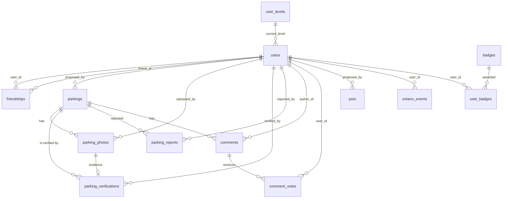
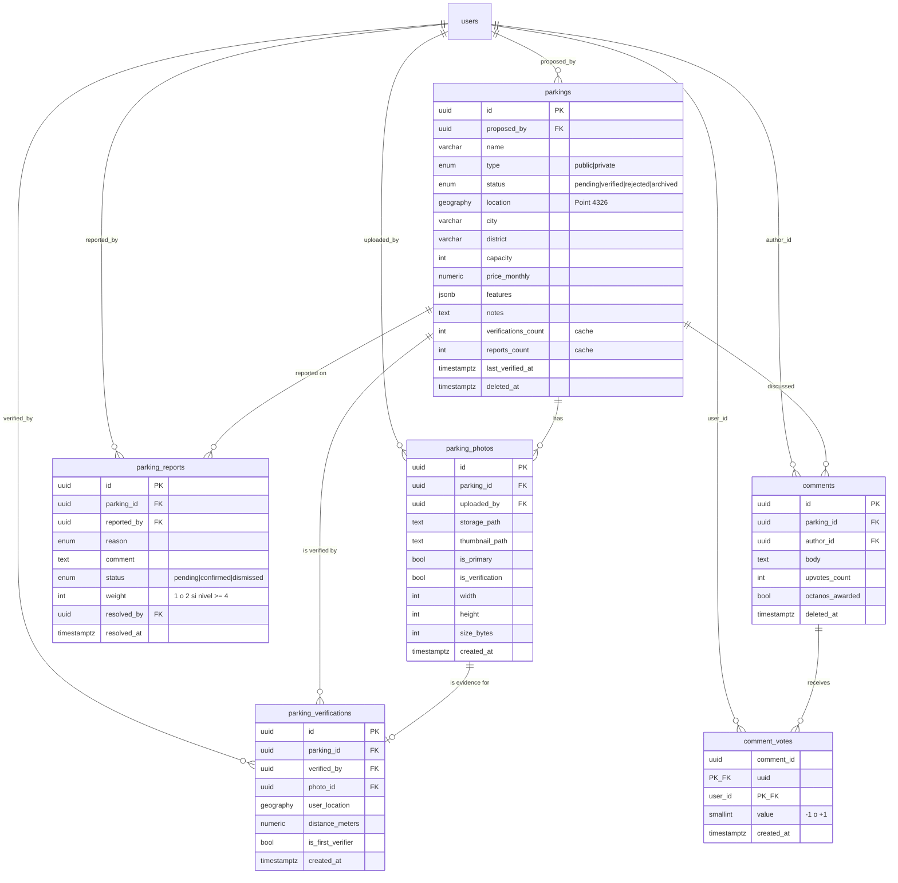
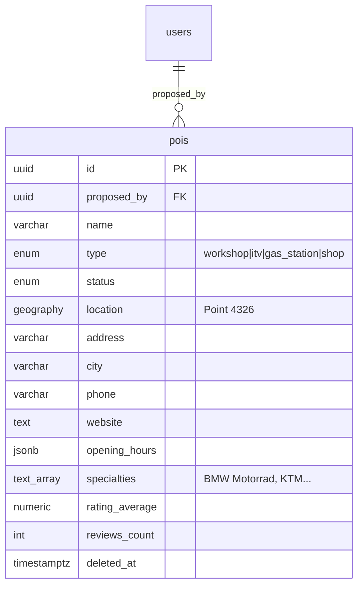
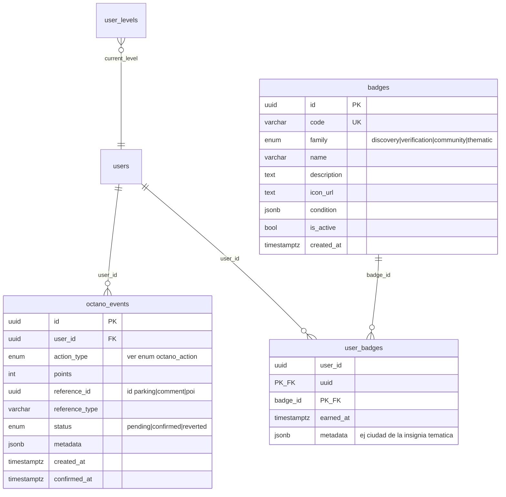
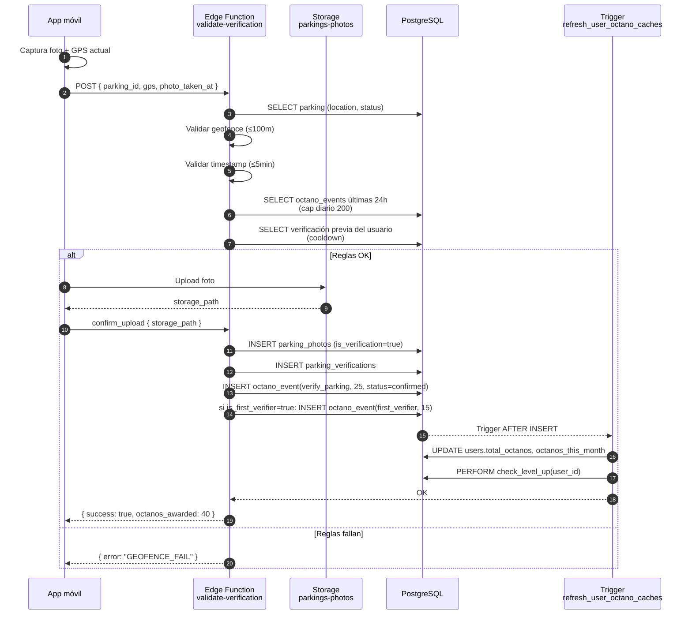
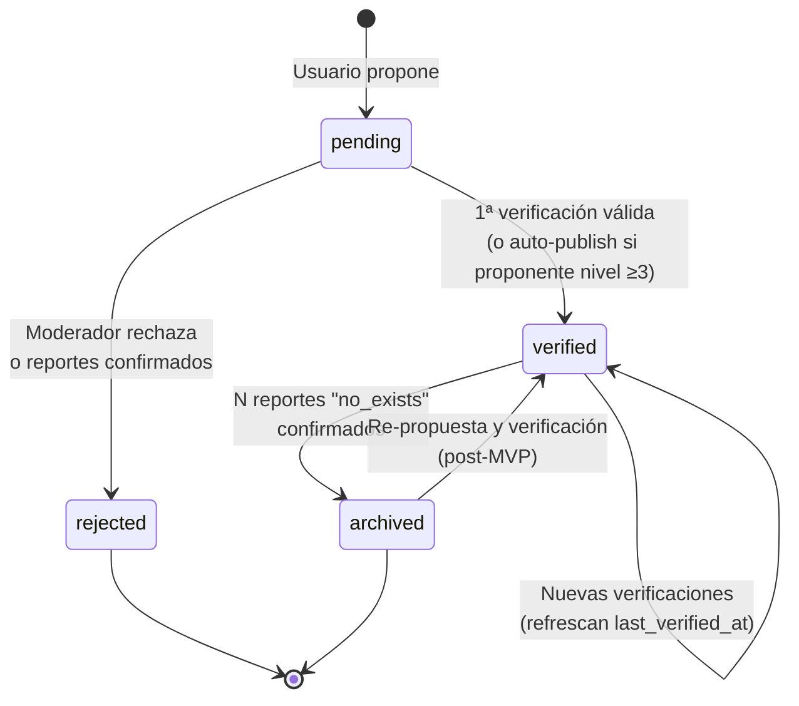
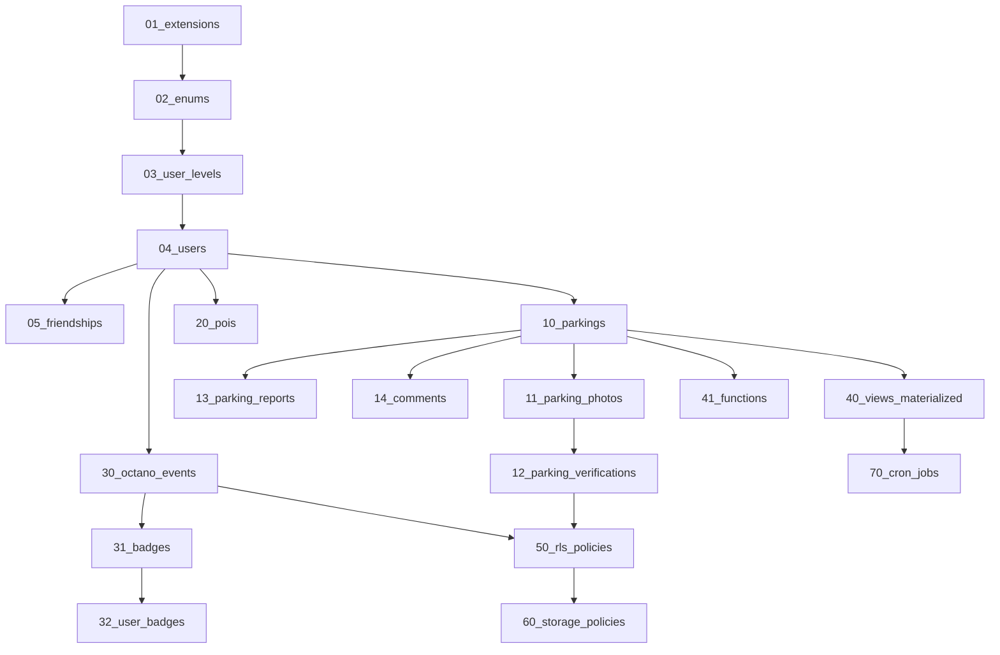

# Modelo de datos — MotoCiudad

> Schema completo de PostgreSQL con extensión PostGIS y políticas RLS.
> Especificación ejecutable: cada tabla está pensada para ser traducida 1:1 a una migración SQL en `supabase/migrations/`.

**Versión**: 0.2 (añadidos diagramas Mermaid)
**Última actualización**: Mayo 2026

---

## 1. Convenciones

- **Identificadores**: UUID v4 generados con `gen_random_uuid()` (extensión `pgcrypto`).
- **Timestamps**: `timestamptz` con default `now()`. Todas las tablas tienen `created_at` y `updated_at` (este último mantenido por trigger).
- **Naming**: snake_case en tablas y columnas, plural en nombres de tablas (`users`, `parkings`).
- **Soft delete**: campo `deleted_at timestamptz null` en entidades que necesitan auditoría (parkings, comments). Resto, hard delete.
- **Geolocalización**: tipo `geography(Point, 4326)` (WGS84). Índice GiST obligatorio.
- **Enums**: implementados como `enum` PostgreSQL para los valores cerrados.

**Cómo leer los diagramas Mermaid**:

- `||--o{` significa "uno a muchos" (un user tiene muchos parkings; un parking tiene un único user proponente).
- `||--||` significa "uno a uno".
- `}o--||` significa "muchos a uno" (muchos users pertenecen a un único user_level).
- Las claves marcadas `PK` son primarias, `FK` son foráneas, `UK` son únicas.

---

## 2. Diagrama ER general

Vista completa del modelo de datos con todas las relaciones entre entidades. Los detalles de cada tabla se desarrollan en las secciones siguientes.



**Lectura rápida del diagrama**:

- `users` es el centro del grafo: prácticamente todas las entidades referencian al usuario que las creó.
- `parkings` es la entidad de dominio principal, rodeada de satélites (`photos`, `verifications`, `reports`, `comments`).
- `octano_events` y `user_badges` viven en su propio subdominio (gamificación) pero conectan vía `users`.
- `pois` (talleres) son una entidad paralela a `parkings`, sin satélites en MVP.
- `friendships` es una autorrelación de `users`.

---

## 3. Extensiones requeridas

```sql
CREATE EXTENSION IF NOT EXISTS "pgcrypto";        -- UUIDs y hashing
CREATE EXTENSION IF NOT EXISTS "postgis";         -- Geolocalización
CREATE EXTENSION IF NOT EXISTS "pg_cron";         -- Tareas programadas
```

---

## 4. Enums

```sql
CREATE TYPE parking_type      AS ENUM ('public', 'private');
CREATE TYPE parking_status    AS ENUM ('pending', 'verified', 'rejected', 'archived');
CREATE TYPE poi_type          AS ENUM ('workshop', 'itv', 'gas_station', 'shop');  -- workshop = taller
CREATE TYPE report_reason     AS ENUM ('not_exists', 'wrong_location', 'closed', 'private_now', 'duplicate', 'other');
CREATE TYPE report_status     AS ENUM ('pending', 'confirmed', 'dismissed');
CREATE TYPE octano_action     AS ENUM (
  'propose_parking',
  'parking_verified_bonus',
  'verify_parking',
  'first_verifier',
  'report_error',
  'upload_photo',
  'useful_comment',
  'propose_poi',
  'weekly_streak',
  'invite_friend'
);
CREATE TYPE octano_status     AS ENUM ('pending', 'confirmed', 'reverted');
CREATE TYPE badge_family      AS ENUM ('discovery', 'verification', 'community', 'thematic');
CREATE TYPE friendship_status AS ENUM ('pending', 'accepted', 'blocked');
```

---

## 5. Tablas — Identidad

### 5.1 Diagrama del subdominio de identidad

```mermaid
erDiagram
    user_levels ||--o{ users : "current_level"
    users ||--o{ friendships : "user_id"
    users ||--o{ friendships : "friend_id"

    user_levels {
        int level PK
        varchar name
        int min_octanos UK
        jsonb benefits
        text icon_url
        timestamptz created_at
    }

    users {
        uuid id PK_FK "REFS auth.users.id"
        varchar username UK
        varchar display_name
        text avatar_url
        varchar bike_model
        varchar city_primary
        int current_level FK
        int total_octanos "cache derivado"
        int octanos_this_month "cache derivado"
        bool ranking_visible
        bool flagged_for_review
        timestamptz created_at
        timestamptz updated_at
    }

    friendships {
        uuid user_id PK_FK
        uuid friend_id PK_FK
        enum status "pending|accepted|blocked"
        timestamptz created_at
        timestamptz updated_at
    }
```

### 5.2 `users`

Extiende `auth.users` (gestionado por Supabase Auth). Esta es la tabla pública del perfil.

```sql
CREATE TABLE public.users (
  id                  UUID PRIMARY KEY REFERENCES auth.users(id) ON DELETE CASCADE,
  username            VARCHAR(30) UNIQUE NOT NULL,
  display_name        VARCHAR(60) NOT NULL,
  avatar_url          TEXT,
  bike_model          VARCHAR(80),                       -- "Z900", "MT-07"...
  city_primary        VARCHAR(80),                       -- ciudad principal de actividad
  current_level       INTEGER NOT NULL DEFAULT 1
                      REFERENCES user_levels(level),
  total_octanos       INTEGER NOT NULL DEFAULT 0,        -- caché derivado de octano_events
  octanos_this_month  INTEGER NOT NULL DEFAULT 0,        -- caché para ranking
  ranking_visible     BOOLEAN NOT NULL DEFAULT TRUE,
  flagged_for_review  BOOLEAN NOT NULL DEFAULT FALSE,    -- cuenta sospechosa de farmeo
  created_at          TIMESTAMPTZ NOT NULL DEFAULT now(),
  updated_at          TIMESTAMPTZ NOT NULL DEFAULT now()
);

CREATE INDEX idx_users_city ON public.users(city_primary) WHERE ranking_visible = TRUE;
CREATE INDEX idx_users_total_octanos ON public.users(total_octanos DESC) WHERE ranking_visible = TRUE;
```

**Notas**:
- `total_octanos` y `octanos_this_month` son cachés. Fuente de verdad: `octano_events`.
- `username` es único, inmutable post-registro.
- `display_name` editable libremente.

### 5.3 `user_levels` (catálogo)

Tabla de catálogo, datos cargados en seed.

```sql
CREATE TABLE public.user_levels (
  level         INTEGER PRIMARY KEY,           -- 1 a 7
  name          VARCHAR(40) NOT NULL,
  min_octanos   INTEGER NOT NULL UNIQUE,
  benefits      JSONB NOT NULL DEFAULT '[]'::jsonb,
  icon_url      TEXT,
  created_at    TIMESTAMPTZ NOT NULL DEFAULT now()
);

-- Datos iniciales (ver gamificacion.md §3)
INSERT INTO public.user_levels (level, name, min_octanos, benefits) VALUES
  (1, 'Pipiolo',              0,     '["read", "propose", "comment"]'),
  (2, 'Rodador',              101,   '["verify"]'),
  (3, 'Buscaplazas',          501,   '["auto_publish"]'),
  (4, 'Cartógrafo',           1501,  '["report_double_weight"]'),
  (5, 'Centinela',            4001,  '["moderation_double_vote"]'),
  (6, 'Maestro Motero',       10001, '["edit_metadata"]'),
  (7, 'Leyenda del Asfalto',  25001, '["special_badge", "beta_access"]');
```

### 5.4 `friendships`

Sistema de amigos para ranking privado. Opt-in mutuo.

```sql
CREATE TABLE public.friendships (
  user_id     UUID NOT NULL REFERENCES public.users(id) ON DELETE CASCADE,
  friend_id   UUID NOT NULL REFERENCES public.users(id) ON DELETE CASCADE,
  status      friendship_status NOT NULL DEFAULT 'pending',
  created_at  TIMESTAMPTZ NOT NULL DEFAULT now(),
  updated_at  TIMESTAMPTZ NOT NULL DEFAULT now(),
  PRIMARY KEY (user_id, friend_id),
  CHECK (user_id <> friend_id)
);

CREATE INDEX idx_friendships_friend ON public.friendships(friend_id, status);
```

---

## 6. Tablas — Dominio principal (parkings)

### 6.1 Diagrama del subdominio de parkings



### 6.2 `parkings`

Entidad core. Cada fila es un parking propuesto o verificado.

```sql
CREATE TABLE public.parkings (
  id                  UUID PRIMARY KEY DEFAULT gen_random_uuid(),
  proposed_by         UUID NOT NULL REFERENCES public.users(id),
  name                VARCHAR(120) NOT NULL,
  type                parking_type NOT NULL,
  status              parking_status NOT NULL DEFAULT 'pending',
  location            GEOGRAPHY(Point, 4326) NOT NULL,
  address             VARCHAR(200),
  city                VARCHAR(80) NOT NULL,
  district            VARCHAR(80),                       -- "Malasaña", "Lavapiés"
  capacity            INTEGER,                           -- nº plazas aprox, nullable
  price_monthly       NUMERIC(7, 2),                     -- € / mes (privados)
  features            JSONB NOT NULL DEFAULT '{}'::jsonb,
  -- features ej.: {"covered": true, "cameras": true, "anchors": false, "lit": true,
  --                "free": true, "h24": true, "battery_layout": true}
  notes               TEXT,                              -- comentario libre del proponente
  verifications_count INTEGER NOT NULL DEFAULT 0,        -- caché derivado
  reports_count       INTEGER NOT NULL DEFAULT 0,        -- caché derivado
  last_verified_at    TIMESTAMPTZ,
  created_at          TIMESTAMPTZ NOT NULL DEFAULT now(),
  updated_at          TIMESTAMPTZ NOT NULL DEFAULT now(),
  deleted_at          TIMESTAMPTZ
);

CREATE INDEX idx_parkings_location  ON public.parkings USING GIST (location);
CREATE INDEX idx_parkings_status    ON public.parkings(status) WHERE deleted_at IS NULL;
CREATE INDEX idx_parkings_city      ON public.parkings(city) WHERE deleted_at IS NULL;
CREATE INDEX idx_parkings_proposer  ON public.parkings(proposed_by);
```

**Convenciones de `features` (JSONB)**:

| Clave | Tipo | Significado |
|---|---|---|
| `covered` | bool | Tiene techo/cubierta |
| `cameras` | bool | Vigilancia con cámaras |
| `anchors` | bool | Anclajes para candados |
| `lit` | bool | Iluminado |
| `free` | bool | Gratuito (false implica privado de pago) |
| `h24` | bool | Acceso 24h |
| `battery_layout` | bool | Plazas en batería (vs. cordón) |

### 6.3 `parking_photos`

Una fila por foto subida.

```sql
CREATE TABLE public.parking_photos (
  id            UUID PRIMARY KEY DEFAULT gen_random_uuid(),
  parking_id    UUID NOT NULL REFERENCES public.parkings(id) ON DELETE CASCADE,
  uploaded_by   UUID NOT NULL REFERENCES public.users(id),
  storage_path  TEXT NOT NULL,                           -- key en Supabase Storage
  thumbnail_path TEXT,
  is_primary    BOOLEAN NOT NULL DEFAULT FALSE,          -- foto destacada del parking
  is_verification BOOLEAN NOT NULL DEFAULT FALSE,        -- foto que viene de un acto de verificación
  width         INTEGER,
  height        INTEGER,
  size_bytes    INTEGER,
  created_at    TIMESTAMPTZ NOT NULL DEFAULT now()
);

CREATE INDEX idx_photos_parking ON public.parking_photos(parking_id);
CREATE INDEX idx_photos_uploader ON public.parking_photos(uploaded_by);
```

### 6.4 `parking_verifications`

Cada acto de verificación in situ. Es la acción más valiosa del sistema.

```sql
CREATE TABLE public.parking_verifications (
  id              UUID PRIMARY KEY DEFAULT gen_random_uuid(),
  parking_id      UUID NOT NULL REFERENCES public.parkings(id) ON DELETE CASCADE,
  verified_by     UUID NOT NULL REFERENCES public.users(id),
  photo_id        UUID NOT NULL REFERENCES public.parking_photos(id),
  user_location   GEOGRAPHY(Point, 4326) NOT NULL,        -- posición declarada del cliente
  distance_meters NUMERIC(8, 2) NOT NULL,                 -- distancia al parking (validada)
  is_first_verifier BOOLEAN NOT NULL DEFAULT FALSE,
  created_at      TIMESTAMPTZ NOT NULL DEFAULT now(),
  UNIQUE (parking_id, verified_by)                        -- cooldown: 1 verificación por parking y usuario
);

CREATE INDEX idx_verifications_parking ON public.parking_verifications(parking_id);
CREATE INDEX idx_verifications_user ON public.parking_verifications(verified_by);
```

### 6.5 `parking_reports`

Reportes de error sobre parkings existentes.

```sql
CREATE TABLE public.parking_reports (
  id            UUID PRIMARY KEY DEFAULT gen_random_uuid(),
  parking_id    UUID NOT NULL REFERENCES public.parkings(id) ON DELETE CASCADE,
  reported_by   UUID NOT NULL REFERENCES public.users(id),
  reason        report_reason NOT NULL,
  comment       TEXT,
  status        report_status NOT NULL DEFAULT 'pending',
  weight        INTEGER NOT NULL DEFAULT 1,               -- 2 si reporter es nivel >= 4
  resolved_at   TIMESTAMPTZ,
  resolved_by   UUID REFERENCES public.users(id),
  created_at    TIMESTAMPTZ NOT NULL DEFAULT now(),
  UNIQUE (parking_id, reported_by, status)                -- evita reports duplicados pendientes
);

CREATE INDEX idx_reports_parking ON public.parking_reports(parking_id);
CREATE INDEX idx_reports_status ON public.parking_reports(status);
```

### 6.6 `comments`

Comentarios sobre parkings. Solo computan Octanos cuando reciben ≥2 upvotes.

```sql
CREATE TABLE public.comments (
  id            UUID PRIMARY KEY DEFAULT gen_random_uuid(),
  parking_id    UUID NOT NULL REFERENCES public.parkings(id) ON DELETE CASCADE,
  author_id     UUID NOT NULL REFERENCES public.users(id),
  body          TEXT NOT NULL CHECK (length(body) BETWEEN 1 AND 500),
  upvotes_count INTEGER NOT NULL DEFAULT 0,               -- caché
  octanos_awarded BOOLEAN NOT NULL DEFAULT FALSE,         -- garantiza pago una sola vez
  created_at    TIMESTAMPTZ NOT NULL DEFAULT now(),
  updated_at    TIMESTAMPTZ NOT NULL DEFAULT now(),
  deleted_at    TIMESTAMPTZ
);

CREATE INDEX idx_comments_parking ON public.comments(parking_id) WHERE deleted_at IS NULL;
```

### 6.7 `comment_votes`

```sql
CREATE TABLE public.comment_votes (
  comment_id    UUID NOT NULL REFERENCES public.comments(id) ON DELETE CASCADE,
  user_id       UUID NOT NULL REFERENCES public.users(id) ON DELETE CASCADE,
  value         SMALLINT NOT NULL CHECK (value IN (-1, 1)),
  created_at    TIMESTAMPTZ NOT NULL DEFAULT now(),
  PRIMARY KEY (comment_id, user_id)
);
```

---

## 7. Tablas — POIs secundarios (talleres)

### 7.1 Diagrama del subdominio de POIs



### 7.2 `pois`

```sql
CREATE TABLE public.pois (
  id                  UUID PRIMARY KEY DEFAULT gen_random_uuid(),
  proposed_by         UUID NOT NULL REFERENCES public.users(id),
  name                VARCHAR(120) NOT NULL,
  type                poi_type NOT NULL,
  status              parking_status NOT NULL DEFAULT 'pending',
  location            GEOGRAPHY(Point, 4326) NOT NULL,
  address             VARCHAR(200),
  city                VARCHAR(80) NOT NULL,
  phone               VARCHAR(20),
  website             TEXT,
  opening_hours       JSONB,                             -- estructura semanal
  -- ej: {"mon": ["09:00-13:30", "16:00-19:30"], "sat": ["09:00-14:00"], ...}
  specialties         TEXT[],                            -- ["BMW Motorrad", "KTM", "Ducati"]
  rating_average      NUMERIC(2, 1),                     -- caché de reseñas externas
  reviews_count       INTEGER NOT NULL DEFAULT 0,
  created_at          TIMESTAMPTZ NOT NULL DEFAULT now(),
  updated_at          TIMESTAMPTZ NOT NULL DEFAULT now(),
  deleted_at          TIMESTAMPTZ
);

CREATE INDEX idx_pois_location ON public.pois USING GIST (location);
CREATE INDEX idx_pois_city ON public.pois(city) WHERE deleted_at IS NULL;
CREATE INDEX idx_pois_type ON public.pois(type) WHERE deleted_at IS NULL;
```

**Nota**: las reseñas detalladas, horarios extendidos y reservas están explícitamente fuera del alcance del MVP (`prd.md` §7.2).

---

## 8. Tablas — Gamificación

Estas tablas implementan lo definido en `gamificacion.md` §7. **Fuente de verdad** del sistema de Octanos.

### 8.1 Diagrama del subdominio de gamificación



### 8.2 `octano_events`

Tabla insert-only que registra cada acción puntuable. La suma sobre `status = 'confirmed'` es la moneda real del usuario.

```sql
CREATE TABLE public.octano_events (
  id              UUID PRIMARY KEY DEFAULT gen_random_uuid(),
  user_id         UUID NOT NULL REFERENCES public.users(id) ON DELETE CASCADE,
  action_type     octano_action NOT NULL,
  points          INTEGER NOT NULL,
  reference_id    UUID,                                   -- id del parking/comment/poi/etc
  reference_type  VARCHAR(20),                            -- "parking", "comment", "poi", "user", "none"
  status          octano_status NOT NULL DEFAULT 'pending',
  metadata        JSONB DEFAULT '{}'::jsonb,              -- contexto extra (ip, ciudad, etc.)
  created_at      TIMESTAMPTZ NOT NULL DEFAULT now(),
  confirmed_at    TIMESTAMPTZ
);

CREATE INDEX idx_octano_events_user ON public.octano_events(user_id, status);
CREATE INDEX idx_octano_events_user_recent ON public.octano_events(user_id, confirmed_at DESC)
  WHERE status = 'confirmed';
CREATE INDEX idx_octano_events_action ON public.octano_events(action_type, created_at);
```

**Trigger crítico**: tras INSERT con `status = 'confirmed'` o tras UPDATE de `status` a `confirmed`, recalcular caché `users.total_octanos` y `users.octanos_this_month`. Implementación en migración:

```sql
CREATE OR REPLACE FUNCTION refresh_user_octano_caches()
RETURNS TRIGGER AS $$
BEGIN
  IF NEW.status = 'confirmed' THEN
    UPDATE public.users
    SET total_octanos = (
          SELECT COALESCE(SUM(points), 0) FROM public.octano_events
          WHERE user_id = NEW.user_id AND status = 'confirmed'
        ),
        octanos_this_month = (
          SELECT COALESCE(SUM(points), 0) FROM public.octano_events
          WHERE user_id = NEW.user_id
            AND status = 'confirmed'
            AND confirmed_at >= now() - INTERVAL '30 days'
        ),
        updated_at = now()
    WHERE id = NEW.user_id;

    -- comprobar subida de nivel y disparar notificación (vía edge function)
    PERFORM check_level_up(NEW.user_id);
  END IF;
  RETURN NEW;
END;
$$ LANGUAGE plpgsql;

CREATE TRIGGER trg_octano_event_confirmed
  AFTER INSERT OR UPDATE OF status ON public.octano_events
  FOR EACH ROW EXECUTE FUNCTION refresh_user_octano_caches();
```

### 8.3 `badges`

```sql
CREATE TABLE public.badges (
  id            UUID PRIMARY KEY DEFAULT gen_random_uuid(),
  code          VARCHAR(60) UNIQUE NOT NULL,             -- "first_finding", "eagle_eye"
  family        badge_family NOT NULL,
  name          VARCHAR(80) NOT NULL,
  description   TEXT NOT NULL,
  icon_url      TEXT,
  condition     JSONB NOT NULL,                          -- regla evaluable
  is_active     BOOLEAN NOT NULL DEFAULT TRUE,
  created_at    TIMESTAMPTZ NOT NULL DEFAULT now()
);

CREATE INDEX idx_badges_active ON public.badges(is_active) WHERE is_active = TRUE;
```

**Estructura del campo `condition` (JSONB)**:

```jsonc
// Ejemplo: insignia "Cartógrafo Local"
{
  "type": "city_count",
  "metric": "approved_parkings",
  "city_match": "same",
  "threshold": 10
}

// Ejemplo: insignia "Ojo de Águila"
{
  "type": "global_count",
  "metric": "verifications",
  "threshold": 25
}

// Ejemplo: insignia "Trotamundos"
{
  "type": "distinct_cities",
  "metric": "approved_parkings",
  "threshold": 5
}
```

La función `check-badges` (Edge Function) evalúa estas condiciones tras cada `octano_event` confirmado.

### 8.4 `user_badges`

```sql
CREATE TABLE public.user_badges (
  user_id     UUID NOT NULL REFERENCES public.users(id) ON DELETE CASCADE,
  badge_id    UUID NOT NULL REFERENCES public.badges(id) ON DELETE CASCADE,
  earned_at   TIMESTAMPTZ NOT NULL DEFAULT now(),
  metadata    JSONB DEFAULT '{}'::jsonb,                 -- ej. ciudad de la insignia temática
  PRIMARY KEY (user_id, badge_id)
);

CREATE INDEX idx_user_badges_user ON public.user_badges(user_id);
```

---

## 9. Flujo de datos en una verificación

Diagrama de secuencia que ilustra el camino que sigue una verificación de parking desde el cliente hasta los Octanos confirmados — útil para ver cómo interactúan las tablas en la operación más compleja del sistema.



**Lectura del flujo**:

- **Pasos 3–6**: validación previa al consumo de Storage (no subimos foto si la verificación va a fallar).
- **Paso 12**: el evento de Octanos nace con `status = 'confirmed'` directamente porque la validación ya ocurrió. Para acciones que requieren moderación (propuesta de parking nueva), nacería en `pending` y se confirmaría tras la verificación de la comunidad.
- **Pasos 16–18**: el trigger es lo que mantiene los cachés y detecta la subida de nivel — el cliente nunca toca esos campos directamente.

---

## 10. Estados del ciclo de vida de un parking



---

## 11. Vistas y materialized views

### 11.1 `parkings_with_stats` (view)

Ayuda a la app a leer parkings con los stats agregados sin múltiples joins.

```sql
CREATE VIEW parkings_with_stats AS
SELECT
  p.*,
  (SELECT COUNT(*) FROM parking_photos ph WHERE ph.parking_id = p.id) AS photos_count,
  (SELECT COUNT(*) FROM comments c WHERE c.parking_id = p.id AND c.deleted_at IS NULL) AS comments_count
FROM parkings p
WHERE p.deleted_at IS NULL;
```

### 11.2 `mv_ranking_global` (materialized view)

Ranking global recalculado por cron (`pg_cron` cada 5 minutos).

```sql
CREATE MATERIALIZED VIEW mv_ranking_global AS
SELECT
  u.id,
  u.username,
  u.display_name,
  u.avatar_url,
  u.current_level,
  u.city_primary,
  u.total_octanos,
  u.octanos_this_month,
  ROW_NUMBER() OVER (ORDER BY u.total_octanos DESC) AS rank_total,
  ROW_NUMBER() OVER (ORDER BY u.octanos_this_month DESC) AS rank_month
FROM users u
WHERE u.ranking_visible = TRUE
  AND u.flagged_for_review = FALSE;

CREATE UNIQUE INDEX ON mv_ranking_global(id);
CREATE INDEX ON mv_ranking_global(rank_total);
CREATE INDEX ON mv_ranking_global(rank_month);

-- Refresh programado:
SELECT cron.schedule('refresh-ranking-global', '*/5 * * * *',
  $$ REFRESH MATERIALIZED VIEW CONCURRENTLY mv_ranking_global; $$);
```

### 11.3 `mv_ranking_by_city` (materialized view)

Como la global pero particionada por `city_primary`.

---

## 12. Funciones SQL clave

### 12.1 `nearby_parkings(...)`

Función llamada desde la app para obtener parkings cercanos.

```sql
CREATE OR REPLACE FUNCTION nearby_parkings(
  in_lat       DOUBLE PRECISION,
  in_lng       DOUBLE PRECISION,
  in_radius_m  INTEGER DEFAULT 5000,
  in_filter    parking_type DEFAULT NULL,
  in_only_verified BOOLEAN DEFAULT FALSE,
  in_limit     INTEGER DEFAULT 100
)
RETURNS TABLE (
  id UUID,
  name VARCHAR,
  type parking_type,
  status parking_status,
  city VARCHAR,
  district VARCHAR,
  capacity INTEGER,
  features JSONB,
  verifications_count INTEGER,
  distance_meters NUMERIC,
  lat DOUBLE PRECISION,
  lng DOUBLE PRECISION
) LANGUAGE sql STABLE AS $$
  SELECT
    p.id, p.name, p.type, p.status, p.city, p.district, p.capacity,
    p.features, p.verifications_count,
    ST_Distance(
      p.location,
      ST_MakePoint(in_lng, in_lat)::geography
    )::numeric AS distance_meters,
    ST_Y(p.location::geometry) AS lat,
    ST_X(p.location::geometry) AS lng
  FROM parkings p
  WHERE p.deleted_at IS NULL
    AND (NOT in_only_verified OR p.status = 'verified')
    AND (in_filter IS NULL OR p.type = in_filter)
    AND ST_DWithin(
          p.location,
          ST_MakePoint(in_lng, in_lat)::geography,
          in_radius_m
        )
  ORDER BY distance_meters ASC
  LIMIT in_limit;
$$;
```

### 12.2 `check_level_up(user_id)`

Comprueba si tras una actualización de Octanos el usuario debe subir de nivel y dispara push notification.

```sql
CREATE OR REPLACE FUNCTION check_level_up(in_user_id UUID)
RETURNS VOID LANGUAGE plpgsql AS $$
DECLARE
  current_level INT;
  new_level INT;
  current_octanos INT;
BEGIN
  SELECT u.current_level, u.total_octanos
    INTO current_level, current_octanos
    FROM users u WHERE u.id = in_user_id;

  SELECT MAX(level) INTO new_level
    FROM user_levels
    WHERE min_octanos <= current_octanos;

  IF new_level > current_level THEN
    UPDATE users SET current_level = new_level WHERE id = in_user_id;
    -- enqueue push notification (via pg_net to edge function)
    PERFORM net.http_post(
      url := current_setting('app.edge_url') || '/notify-level-up',
      body := jsonb_build_object('user_id', in_user_id, 'new_level', new_level)
    );
  END IF;
END;
$$;
```

---

## 13. Row Level Security (RLS)

Activada en todas las tablas. Reglas resumidas:

### 13.1 `users`

```sql
ALTER TABLE users ENABLE ROW LEVEL SECURITY;

-- Cualquiera puede leer perfiles públicos
CREATE POLICY "users_public_read" ON users
  FOR SELECT USING (TRUE);

-- Solo el propio usuario puede actualizar su perfil
CREATE POLICY "users_self_update" ON users
  FOR UPDATE USING (auth.uid() = id);
```

### 13.2 `parkings`

```sql
ALTER TABLE parkings ENABLE ROW LEVEL SECURITY;

-- Cualquier autenticado puede ver parkings verificados
CREATE POLICY "parkings_read_verified" ON parkings
  FOR SELECT TO authenticated
  USING (status = 'verified' AND deleted_at IS NULL);

-- El proponente puede ver sus propios parkings en cualquier estado
CREATE POLICY "parkings_read_own" ON parkings
  FOR SELECT TO authenticated
  USING (proposed_by = auth.uid());

-- Cualquier autenticado puede insertar (status default = pending)
CREATE POLICY "parkings_insert" ON parkings
  FOR INSERT TO authenticated
  WITH CHECK (proposed_by = auth.uid() AND status = 'pending');

-- Solo el dueño y solo en estado pending puede actualizar
CREATE POLICY "parkings_update_own_pending" ON parkings
  FOR UPDATE TO authenticated
  USING (proposed_by = auth.uid() AND status = 'pending')
  WITH CHECK (proposed_by = auth.uid() AND status = 'pending');
```

### 13.3 `octano_events`

**Tabla insert-only y solo desde edge functions (service role)**.

```sql
ALTER TABLE octano_events ENABLE ROW LEVEL SECURITY;

-- Lectura: cada usuario sus propios eventos (para mostrar historial)
CREATE POLICY "octano_events_read_own" ON octano_events
  FOR SELECT TO authenticated
  USING (user_id = auth.uid());

-- Insertar: solo service role (edge functions). Sin política para `authenticated`.
-- Sin política UPDATE ni DELETE para nadie.
```

### 13.4 `parking_verifications`

```sql
ALTER TABLE parking_verifications ENABLE ROW LEVEL SECURITY;

-- Lectura pública (para mostrar quiénes verificaron)
CREATE POLICY "verifications_read" ON parking_verifications
  FOR SELECT TO authenticated USING (TRUE);

-- Inserción: solo a través de edge function `validate-verification`.
-- Sin política para inserción directa desde el cliente.
```

(Resto de policies análogas — el repositorio incluirá un archivo de migración por tabla con sus políticas completas).

---

## 14. Storage (Supabase Storage)

### 14.1 Buckets

| Bucket | Pública | Uso |
|---|---|---|
| `parkings-photos` | Sí (lectura), restringida (escritura) | Fotos de parkings |
| `pois-photos` | Sí (lectura), restringida (escritura) | Fotos de talleres |
| `avatars` | Sí (lectura), restringida (escritura) | Avatares de usuario |

### 14.2 Estructura de paths

```
parkings-photos/{parking_id}/{photo_id}.webp
parkings-photos/{parking_id}/thumbs/{photo_id}.webp
pois-photos/{poi_id}/{photo_id}.webp
avatars/{user_id}.webp
```

### 14.3 Policies de storage

- Insert solo si el usuario está autenticado y el path empieza por `{parking_id}` o `{poi_id}` cuyo registro asocia el usuario como contribuidor.
- Tamaño máximo por archivo: 5 MB.
- Formatos permitidos: image/jpeg, image/png, image/webp.

---

## 15. Auditoría y borrado RGPD

### 15.1 Borrado de cuenta

La función `delete-account` (Edge Function) ejecuta en transacción:

1. Anonimizar contribuciones: `parkings.proposed_by`, `parking_verifications.verified_by`, etc. → reasignar a usuario sistema `[deleted_user]` (UUID fijo).
2. Borrar registros personales: filas en `friendships`, fotos del avatar, eventos `octano_events` (desconectados de identidad pero preservando integridad).
3. Eliminar cuenta de `auth.users` (cascada borra `public.users`).

### 15.2 Audit log

Tabla opcional `audit_log` para acciones de moderación (post-MVP).

---

## 16. Datos seed para desarrollo

`supabase/seed.sql` incluye:

- 7 niveles (`user_levels`).
- ~20 insignias iniciales (`badges`) según `gamificacion.md` §4.
- 3 usuarios de prueba con distintos niveles.
- ~30 parkings en Madrid en estados variados (verified, pending) con coordenadas reales.
- Algunas verificaciones y fotos placeholder.

---

## 17. Migraciones — orden recomendado

Las migraciones se versionan numéricamente (`YYYYMMDDHHMMSS_name.sql`). Orden lógico:

```
01_extensions.sql                 -- pgcrypto, postgis, pg_cron
02_enums.sql                      -- todos los enums
03_user_levels.sql                -- catálogo + seed
04_users.sql                      -- tabla users (post auth)
05_friendships.sql
10_parkings.sql                   -- core dominio
11_parking_photos.sql
12_parking_verifications.sql
13_parking_reports.sql
14_comments.sql                   -- + comment_votes
20_pois.sql
30_octano_events.sql              -- + triggers
31_badges.sql                     -- + seed
32_user_badges.sql
40_views_materialized.sql
41_functions.sql                  -- nearby_parkings, check_level_up
50_rls_policies.sql               -- todas las RLS de una vez
60_storage_policies.sql           -- policies de buckets
70_cron_jobs.sql                  -- pg_cron schedules
```

Diagrama de dependencias entre migraciones (define el orden de aplicación):



---

## 18. Decisiones cerradas

- ✅ PostgreSQL 15 + PostGIS 3.4.
- ✅ `geography(Point, 4326)` para localización.
- ✅ `octano_events` insert-only como fuente de verdad.
- ✅ Cachés derivados (`total_octanos`, etc.) mantenidos por triggers.
- ✅ Materialized views para rankings.
- ✅ RLS activa en todas las tablas, modificaciones críticas vía Edge Functions con service role.

## 19. Decisiones pendientes

- ⏳ Política de retención de fotos (¿borrar las que no son `is_primary` tras 12 meses?).
- ⏳ ¿Necesitamos auditoría detallada en MVP o lo dejamos para v1.x?
- ⏳ ¿Soft delete también en `parkings` o hard delete tras N días en archivado?
- ⏳ ¿Almacenar histórico de cambios de `current_level`? (probablemente sí, vía tabla aparte).

---

## 20. Documentos relacionados

- `prd.md`, `arquitectura.md`, `gamificacion.md`, `testing.md`.
